# M Suite — Üretim & MRP Modülü Kullanım Kılavuzu

**Sürüm:** 1.0 · **Tarih:** 06.08.2026 · **Kapsam:** Üretim & MRP modülünün 8 ekranı, Depo & Stok entegrasyonu ve uçtan uca örnek senaryo
**Hedef kitle:** Üretim planlama uzmanları, üretim müdürleri, satınalma sorumluları ve sistem yöneticileri

> Bu kılavuzdaki tüm ekran görüntüleri, uygulamanın canlı ortamında **"Ahşap Çalışma Masası"** örnek senaryosu adım adım işletilerek alınmıştır. Görsellerdeki her sayı, gerçekten çalıştırılan hesapların sonucudur; kendi ortamınızda aynı adımları izleyerek aynı sonuçlara ulaşabilirsiniz.

---

## İçindekiler

1. [Genel Bakış ve Kapsam](#1-genel-bakış-ve-kapsam)
2. [Temel Kavramlar — Planlama Sözlüğü](#2-temel-kavramlar)
3. [Modüle Erişim ve Yetkiler](#3-modüle-erişim-ve-yetkiler)
4. [Ön Koşullar — Depo & Stok Hazırlığı](#4-ön-koşullar)
5. [Genel Bakış Ekranı](#5-genel-bakış-ekranı)
6. [İş Merkezleri](#6-iş-merkezleri)
7. [Ürün Ağacı & Reçete (BOM)](#7-ürün-ağacı--reçete-bom)
8. [MRP Koşumu — Malzeme İhtiyaç Planlama](#8-mrp-koşumu)
9. [Üretim Emirleri](#9-üretim-emirleri)
10. [Kapasite Planlama](#10-kapasite-planlama)
11. [Maliyetlendirme](#11-maliyetlendirme)
12. [Üretim Raporları](#12-üretim-raporları)
13. [Uçtan Uca Senaryo Özeti](#13-uçtan-uca-senaryo-özeti)
14. [İpuçları ve En İyi Uygulamalar](#14-ipuçları-ve-en-iyi-uygulamalar)
15. [Sık Sorulan Sorular ve Sorun Giderme](#15-sık-sorulan-sorular)
- [Ek A — Yetki (RBAC) Matrisi](#ek-a--yetki-rbac-matrisi)

---

## 1. Genel Bakış ve Kapsam

Üretim & MRP modülü; ürün ağacı (reçete/BOM) tanımından üretim emrinin kapatılmasına kadar uzanan üretim planlama döngüsünün tamamını tek çatı altında yönetir. Modül, **Depo & Stok (WMS)** modülüyle tam entegredir: malzeme kartları, mevcut stoklar ve açık malzeme talepleri doğrudan depodan okunur; tamamlanan üretim emirleri hammadde tüketimini ve mamul girişini otomatik stok hareketi olarak işler.

Modül sol menüde **Üretim & MRP** başlığı altında 8 ekrandan oluşur:

| Ekran | İşlev |
|---|---|
| **Genel Bakış** | KPI kartları, son üretim emirleri, son MRP koşum özeti |
| **Ürün Ağacı & Reçete** | Çok seviyeli BOM tanımı: bileşenler + operasyonlar + fire |
| **İş Merkezleri** | Kapasite kaynakları: günlük çalışma saati + saat maliyeti |
| **Üretim Emirleri** | Emir yaşam döngüsü (tablo + kanban), stok entegrasyonlu tamamlama |
| **MRP Koşumu** | Talep → çok seviyeli patlatma → satınalma/üretim önerileri |
| **Kapasite Planlama** | Açık emirlerin iş merkezi yükü ve darboğaz analizi |
| **Maliyetlendirme** | Reçete bazlı birim maliyet dökümü (malzeme + işçilik + genel gider) |
| **Üretim Raporları** | Fire, performans, maliyet analizi ve WIP raporları |

MRP hesabı öncelikle sunucudaki hesap motorunda (backend) çalışır; sunucuya erişilemezse aynı sözleşmeyle çalışan yerel hesaba düşer. Hangi motorun kullanıldığı sonuç ekranında rozetle gösterilir (**BACKEND MRP** / **Yerel Hesap**).

### Kılavuz senaryosu

Kılavuz boyunca iki seviyeli gerçekçi bir mobilya senaryosu kullanılır:

- **MAM.001 Ahşap Çalışma Masası** (nihai mamul) = 1 Masa Tablası + 1 Metal Ayak Takımı + 1 Vida Seti + 1 Koli
- **YM.001 Masa Tablası (İşlenmiş)** (yarı mamul) = 1,2 m² Ahşap Panel (%5 fire) + 0,3 L Vernik (%10 fire)

Müşteri talebi: **40 adet sipariş** (termin 20.08.2026) + **10 adet satış tahmini** (31.08.2026).

---

## 2. Temel Kavramlar

| Kavram | Açıklama |
|---|---|
| **Reçete / Ürün Ağacı (BOM)** | Bir mamulü üretmek için gereken bileşen listesi + üretim operasyonları. Çok seviyeli olabilir: bir bileşenin kendi reçetesi varsa **yarı mamul** kabul edilir ve patlatmada bir alt seviye açılır. |
| **Bileşen** | Reçetede tüketilen hammadde/yarı mamul satırı: miktar, birim ve **fire %** taşır. |
| **Fire %** | İşleme kaybı payı. Gerekli miktar = reçete miktarı × (1 + fire/100). |
| **Operasyon** | Reçetenin iş merkezinde yürütülen adımı: **hazırlık (dk)** + **birim başına süre (dk)**. Kapasite ve işçilik maliyeti hesabının temelidir. |
| **İş Merkezi** | Kapasite kaynağı (tezgâh, hat, istasyon). Günlük çalışma saati ve saat maliyeti (₺/sa) tanımlanır. |
| **Brüt / Net İhtiyaç** | Brüt = talepten patlatılan miktar. **Net = Talep + Güvenlik Stoğu − Mevcut Stok − Yoldaki Sipariş** (ekrandaki resmi formül). Net > 0 ise öneri üretilir. |
| **Güvenlik Stoğu** | Malzeme kartındaki **asgari stok** değeri; MRP parametresi açıksa ihtiyaca eklenir. |
| **Yoldaki Sipariş** | Depo & Stok modülündeki **beklemede/onaylı** malzeme talepleri; parametre açıksa açık talepten düşülür. |
| **Planlama Ufku** | Kapasite karşılaştırmasında kullanılan gün sayısı. Kullanılabilir kapasite = günlük saat × ufuk. |
| **Sipariş / Tahmin** | Talep satırı tipi. İkisi de ihtiyaca girer; tahmin, kesinleşmemiş satış öngörüsüdür ve planlama disiplini açısından ayrı izlenir. |
| **Darboğaz** | Yükü kullanılabilir kapasiteyi aşan (%100+) iş merkezi. Kapasite sekmesinde kırmızı gösterilir. |
| **Emir Durumları** | Planlandı → Serbest Bırakıldı → Üretimde → Tamamlandı; ayrıca İptal. Stok yalnızca **Tamamlandı**'ya geçişte işlenir. |
| **WIP** | Work in Progress — açık (tamamlanmamış/iptal edilmemiş) üretim emirleri. |
| **Hareketli Ortalama Maliyet** | Malzeme kartında alış fiyatı yoksa maliyet, depo hareketlerinden türetilen hareketli ortalamayla hesaplanır. |
| **Genel Gider %** | Maliyetlendirmede (malzeme + işçilik) üzerine eklenen yüzde. |

---

## 3. Modüle Erişim ve Yetkiler

### 3.1 Sisteme giriş

Kullanıcı adı ve şifrenizle giriş yapın. (Örnek ortamda `admin` kullanıcısı kullanılmıştır.)

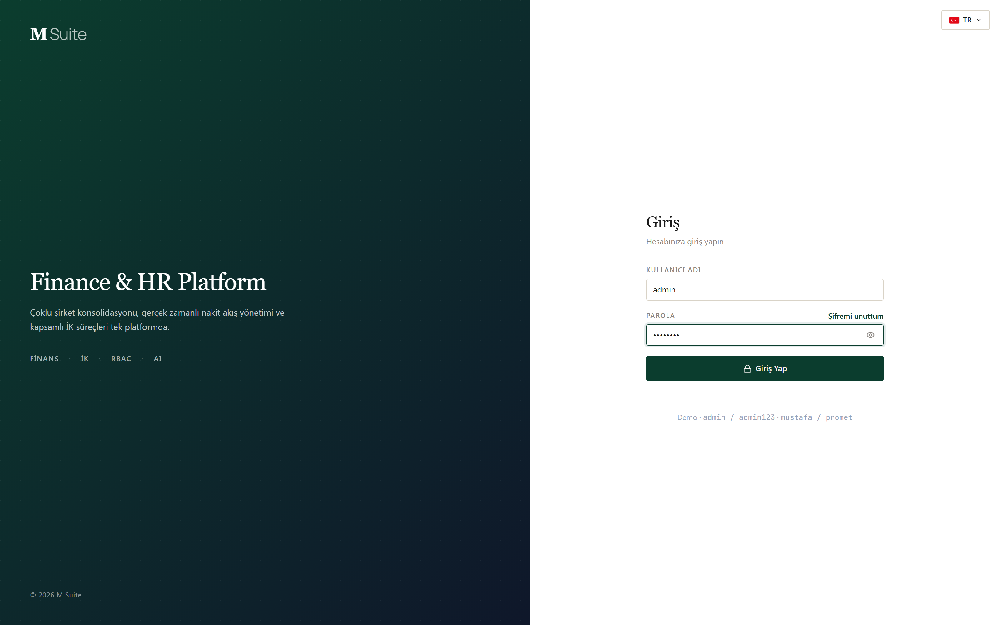
*Görsel 1 — Giriş ekranı*

### 3.2 Modüle ulaşma

Girişten sonra sol menüde **Üretim & MRP** başlığına tıklayın; 8 alt ekran açılır. Modül, üst bardaki aktif şirket bağlamında çalışır (çoklu şirket desteklidir).

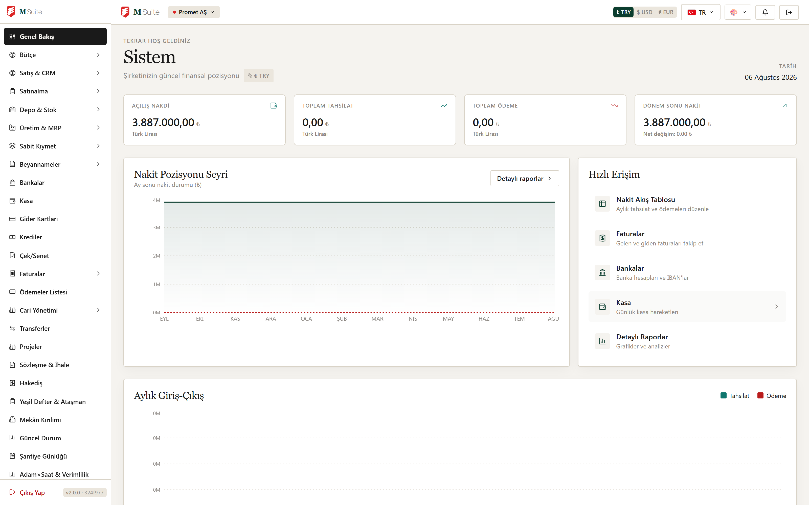
*Görsel 2 — Ana ekran ve sol menü*

### 3.3 Yetkiler

Ekran ve eylem erişimi RBAC ile yönetilir (bkz. [Ek A](#ek-a--yetki-rbac-matrisi)). Örneğin reçete oluşturma/düzenleme/silme butonları yalnızca ilgili eylem yetkisi olan kullanıcılara görünür.

---

## 4. Ön Koşullar

Üretim planlaması sağlıklı çalışsın diye **önce Depo & Stok modülünde** şu hazırlıklar yapılmalıdır.

### 4.1 Malzeme kartları

**Depo & Stok → Malzeme Kartları** ekranında üretimde kullanılacak tüm malzemeleri tanımlayın: mamul, yarı mamul, hammadde ve ambalaj. Kod sistematiği önerimiz:

| Kod | Malzeme | Birim | Asgari Stok | Alış Fiyatı |
|---|---|---|---|---|
| MAM.001 | Ahşap Çalışma Masası (mamul) | Adet | 5 | — (üretilir) |
| YM.001 | Masa Tablası (İşlenmiş) (yarı mamul) | Adet | 0 | — (üretilir) |
| HM.001 | Ahşap Panel 18mm | m² | 20 | 450 ₺ |
| HM.002 | Metal Ayak Takımı | Takım | 5 | 350 ₺ |
| HM.003 | Vida & Bağlantı Seti | Paket | 20 | 25 ₺ |
| HM.004 | Vernik (Su Bazlı) | Litre | 10 | 180 ₺ |
| AMB.001 | Koli & Ambalaj Seti | Adet | 10 | 15 ₺ |

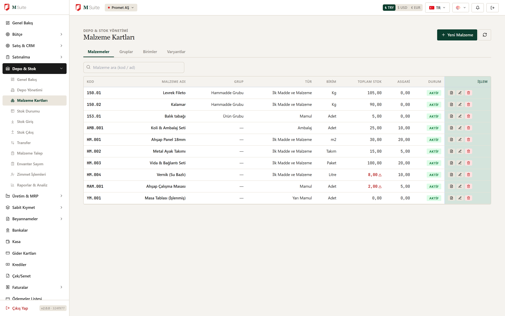
*Görsel 3 — Depo & Stok › Malzeme Kartları*

Planlama açısından üç alan kritiktir:

- **Birim** — reçete ve stok hareketlerinin ortak dili.
- **Asgari stok** — MRP'de **güvenlik stoğu** olarak kullanılır ve Kritik Stok raporunu besler.
- **Alış fiyatı** — satınalma önerisi maliyet tahmini ve reçete maliyetlendirmesinde kullanılır; boşsa depo hareketlerinden hareketli ortalama devreye girer.

### 4.2 Depo ve açılış stokları

En az bir depo tanımlı olmalıdır (senaryoda *Çayyolu Üretim Deposu*). Mevcut stoklar **Stok Giriş** (devir) ile sisteme alınır. Senaryonun açılış stokları:

| Malzeme | Açılış Stoku |
|---|---|
| Ahşap Panel 18mm | 30 m² |
| Metal Ayak Takımı | 15 Takım |
| Vida & Bağlantı Seti | 100 Paket |
| Vernik (Su Bazlı) | 8 Litre *(asgarinin altında!)* |
| Koli & Ambalaj Seti | 25 Adet |
| Ahşap Çalışma Masası | 2 Adet |

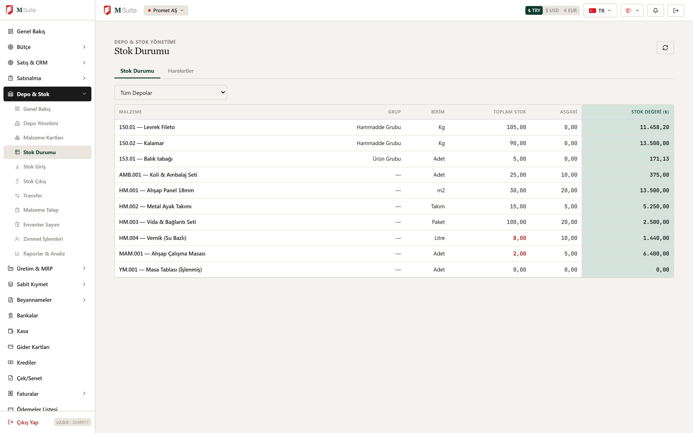
*Görsel 4 — Açılış stokları (Vernik 8 < 10 asgari — kırmızı uyarı)*

> **Not:** Malzeme kartında tedarik süresi (termin) alanı henüz yönetilmediği için MRP satınalma önerilerinde **Termin (gün)** kolonu 0 görünür. Tedarik sürelerini satınalma planlamasında ayrıca değerlendirin.

---

## 5. Genel Bakış Ekranı

**Üretim & MRP → Genel Bakış**, modülün kokpitidir:

- **6 KPI kartı:** Açık Üretim Emri · Üretimde · Tamamlanan (toplam) · Aktif Reçete · İş Merkezi · Kritik Stok
- **Son Üretim Emirleri** tablosu (no, mamul, miktar, durum)
- **Son MRP Koşumu** özeti (tarih, satınalma/üretim önerisi kalem sayısı, tahmini satınalma tutarı, darboğaz sayısı) ve MRP ekranına kısayol

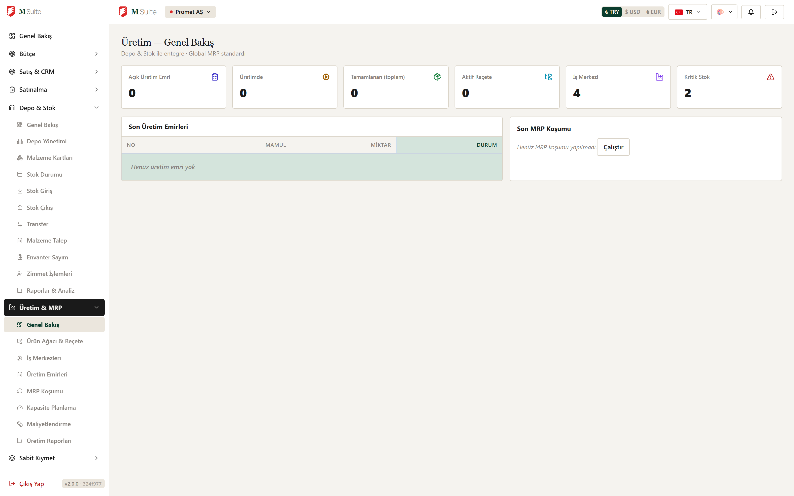
*Görsel 5 — Henüz emir ve koşum yokken Genel Bakış*

Senaryo tamamlandıktan sonra aynı ekran dolu hâliyle şöyle görünür:

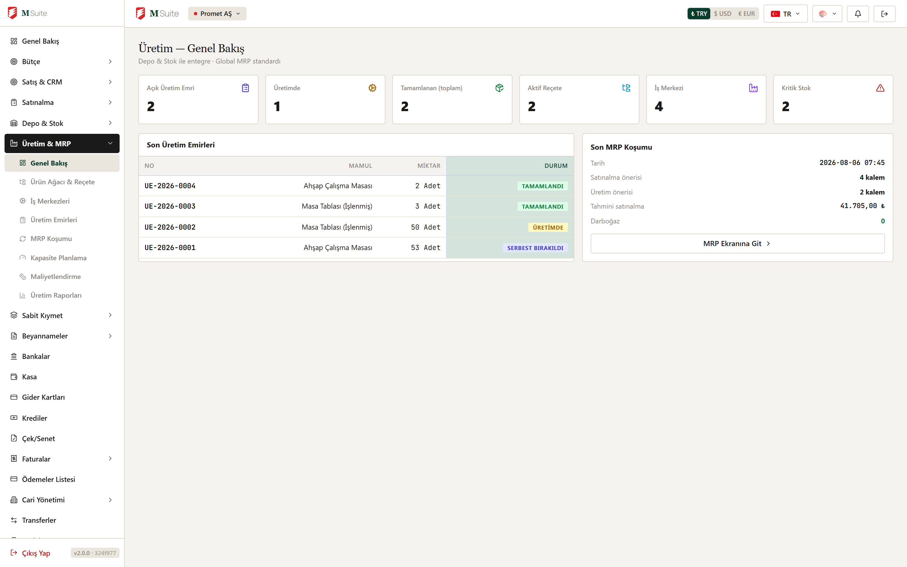
*Görsel 6 — Senaryo sonunda Genel Bakış: 2 açık emir, 1 üretimde, 2 tamamlanan; son koşum 4 satınalma + 2 üretim önerisi, 41.705 ₺ tahmini satınalma*

---

## 6. İş Merkezleri

**Üretim & MRP → İş Merkezleri**, kapasite kaynaklarınızı yönetir. Sistem ilk açılışta 4 örnek iş merkeziyle gelir:

| Kod | İş Merkezi | Günlük Saat | Saat Maliyeti |
|---|---|---|---|
| IM-01 | Kesim | 8 sa | 120 ₺ |
| IM-02 | Montaj | 8 sa | 150 ₺ |
| IM-03 | Boya / Kaplama | 8 sa | 100 ₺ |
| IM-04 | Paketleme | 8 sa | 80 ₺ |

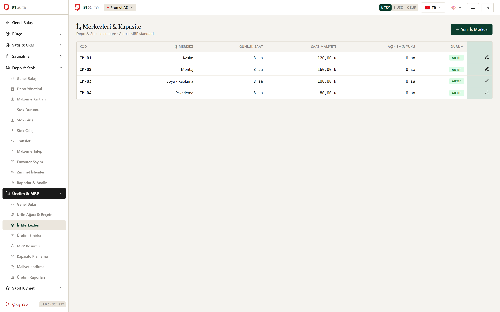
*Görsel 7 — İş Merkezleri listesi; "Açık Emir Yükü" kolonu açık emirlerin planlanan sürelerini saat cinsinden toplar*

**Yeni İş Merkezi** butonuyla kendi kaynaklarınızı ekleyin:

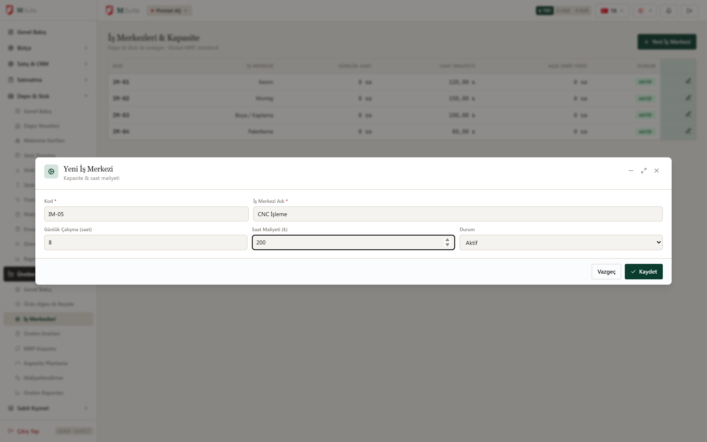
*Görsel 8 — Yeni İş Merkezi: kod, ad, günlük çalışma saati, saat maliyeti, durum*

> **Planlama notu:** *Günlük çalışma saati* kapasite hesabının, *saat maliyeti* işçilik maliyetinin temelidir. Vardiya değişikliklerinde (örn. 8→16 saat) burayı güncellemeyi unutmayın; kullanılmayan kaynağı silmek yerine **Pasif** yapın.

---

## 7. Ürün Ağacı & Reçete (BOM)

**Üretim & MRP → Ürün Ağacı & Reçete**, planlamanın kalbidir. **Yeni Reçete** butonuyla açılan pencerede dört bölüm vardır:

1. **Başlık:** Mamul (üretilecek ürün) · Çıktı Miktarı · Versiyon · Durum (Aktif/Taslak/Pasif)
2. **Bileşenler:** malzeme + miktar + birim + fire %
3. **Operasyonlar:** iş merkezi + operasyon adı + hazırlık (dk) + birim/dk
4. **Canlı maliyet şeridi:** siz yazdıkça tahmini birim maliyet güncellenir

### 7.1 Yarı mamul reçetesi — Masa Tablası

Önce alt seviye reçetesini tanımlayın:

- **Mamul:** YM.001 Masa Tablası (İşlenmiş), çıktı 1 Adet
- **Bileşenler:** 1,2 m² Ahşap Panel (%5 fire) + 0,3 L Vernik (%10 fire)
- **Operasyonlar:** Kesim & Ebatlama (IM-01; 15 dk hazırlık + 10 dk/br) · Yüzey İşlem & Vernik (IM-03; 20 + 15 dk/br)

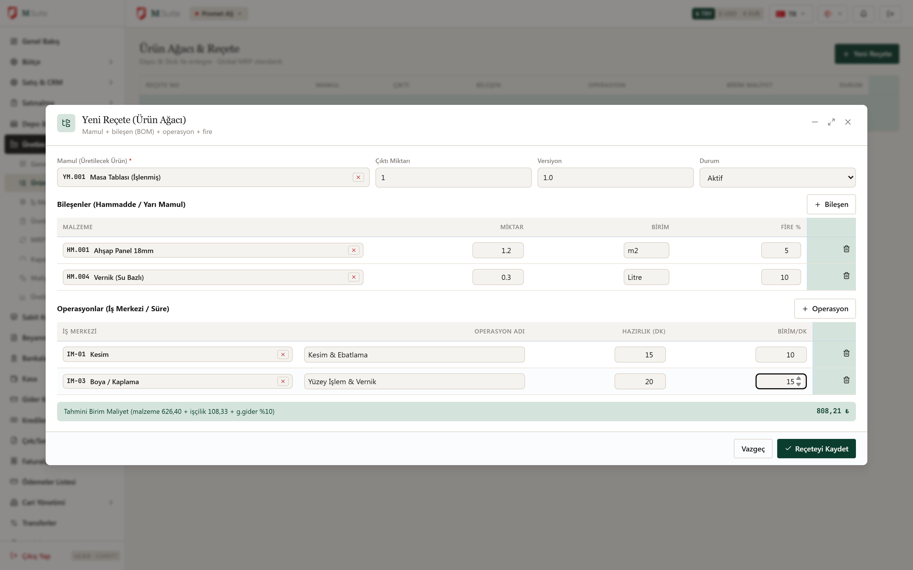
*Görsel 9 — Masa Tablası reçetesi; alttaki şeritte canlı birim maliyet: 808,21 ₺*

> **Dikkat:** Bileşen malzemesini seçtiğinizde **birim alanı otomatik güncellenmez** — malzemenin temel birimini (m², Litre…) elle doğru yazın.

### 7.2 Nihai mamul reçetesi — Ahşap Çalışma Masası

- **Mamul:** MAM.001 Ahşap Çalışma Masası, çıktı 1 Adet
- **Bileşenler:** 1 Adet Masa Tablası *(sistem "yarı mamul" rozetiyle işaretler)* + 1 Takım Metal Ayak + 1 Paket Vida Seti (%2 fire) + 1 Adet Koli
- **Operasyonlar:** Gövde Montajı (IM-02; 10 + 20 dk/br) · Paketleme & Sevk Hazırlık (IM-04; 5 + 5 dk/br)

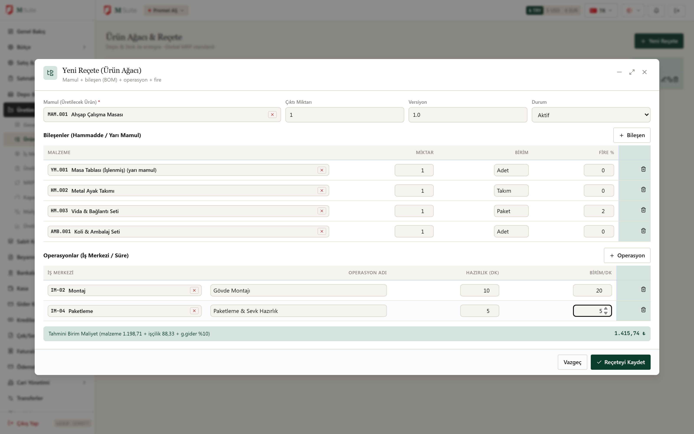
*Görsel 10 — Masa reçetesi; Masa Tablası bileşeni "yarı mamul" rozetli — MRP patlatmada bir alt seviye açacak*

### 7.3 Reçete listesi

Kaydedilen reçeteler listede numara (REC-YYYY-NNNN), bileşen/operasyon sayısı, **birim maliyet** ve durumla görünür. Satır ikonlarıyla düzenleme, maliyet ekranına gitme ve silme yapılır.

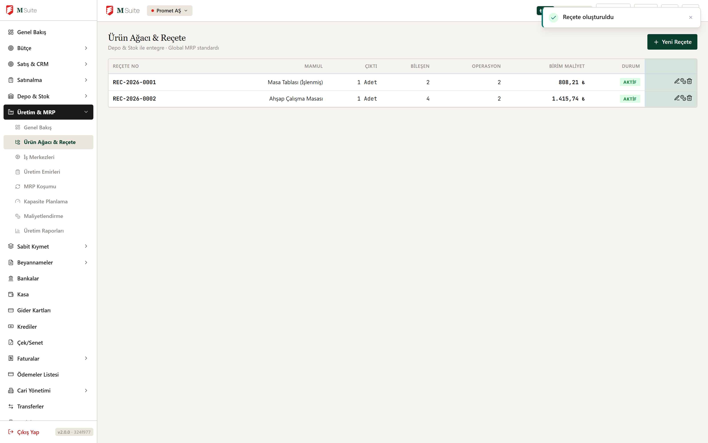
*Görsel 11 — İki reçete: tabla 808,21 ₺, masa 1.415,74 ₺ birim maliyet*

> **Kural:** Bir mamul için birden çok reçete tanımlanabilir; MRP ve emirlerde o mamulün **ilk aktif** reçetesi esas alınır. Alternatif reçeteleri *Taslak/Pasif* durumda tutun. Ürün revizyonlarında **Versiyon** alanını yükseltin.

---

## 8. MRP Koşumu

**Üretim & MRP → MRP Koşumu**, talebi alıp çok seviyeli ürün ağacını patlatır ve net ihtiyaçları önerilere dönüştürür.

### 8.1 Talep girme

Sol karttaki **+ Satır** butonuyla talep ekleyin. Her satırda mamul, miktar, termin ve tip (**Sipariş** / **Tahmin**) bulunur. Senaryoda:

- 40 Adet Ahşap Çalışma Masası — 20.08.2026 — Sipariş
- 10 Adet Ahşap Çalışma Masası — 31.08.2026 — Tahmin

### 8.2 Parametreler

| Parametre | Anlamı | Senaryo |
|---|---|---|
| **Planlama Ufku (gün)** | Kapasite karşılaştırma penceresi | 30 |
| **Güvenlik stoğunu hesaba kat** | Asgari stok ihtiyaca eklenir | Açık |
| **Yoldaki siparişi düş** | Beklemede/onaylı depo talepleri açık talepten düşülür | Açık |

Ekranın altındaki formül her zaman görünür: **İhtiyaç = Talep + Güvenlik Stoğu − Mevcut Stok − Yoldaki Sipariş.**

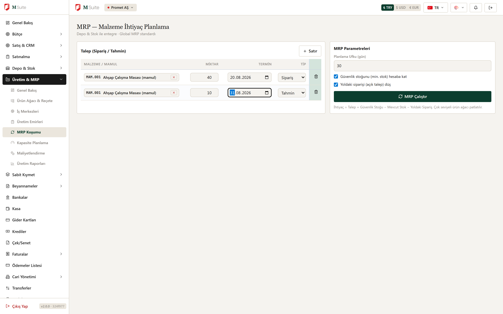
*Görsel 12 — Talep satırları ve parametreler, koşum öncesi*

### 8.3 Koşum ve sonuç sekmeleri

**MRP Çalıştır** butonuna basın. Sonuç kartı 4 sekmeden oluşur; sağ üstteki rozet hesabın nerede yapıldığını gösterir (**BACKEND MRP**).

**a) Satınalma önerileri** — üretilmeyen (reçetesiz) malzemelerin net ihtiyacı:

| Malzeme | Net İhtiyaç | Tahmini Maliyet |
|---|---|---|
| Ahşap Panel 18mm | 53 m² | 23.850,00 ₺ |
| Metal Ayak Takımı | 40 Takım | 14.000,00 ₺ |
| Vernik (Su Bazlı) | 19 Litre | 3.330,00 ₺ |
| Koli & Ambalaj Seti | 35 Adet | 525,00 ₺ |

Vida Seti önerilerde **yok** — 100 paket stok, güvenlik stoğu düşüldükten sonra bile 50 birimlik ihtiyacı karşılıyor. MRP'nin işi tam da budur: yalnızca *gerçekten* eksik olanı önermek.

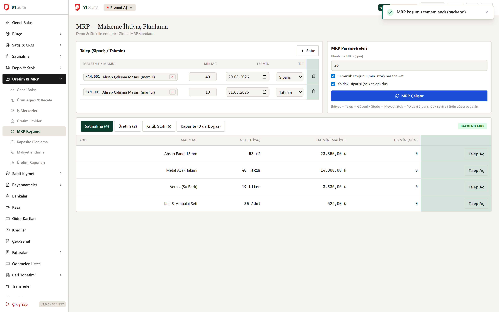
*Görsel 13 — Satınalma önerileri; toplam tahmini satınalma 41.705 ₺*

**b) Üretim önerileri** — çok seviyeli patlatma sonucu, seviye numarası ve ağaç girintisiyle:

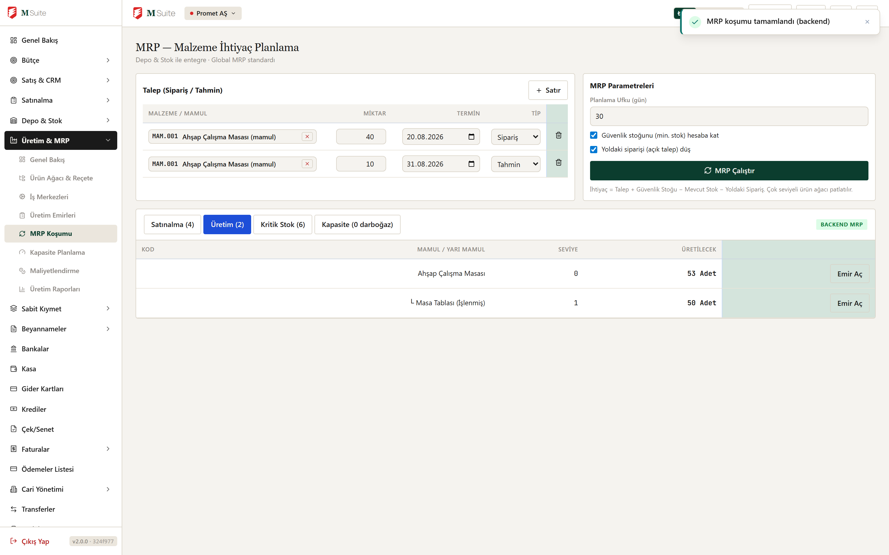
*Görsel 14 — Üretim önerileri: 53 Adet masa (seviye 0) → 50 Adet tabla (seviye 1). Masadaki 53 = 50 talep + 5 güvenlik − 2 stok*

**c) Kritik stok** — güvenlik stoğu altına düşmüş malzemeler (senaryoda Vernik 8 < 10 dâhil 6 kalem).

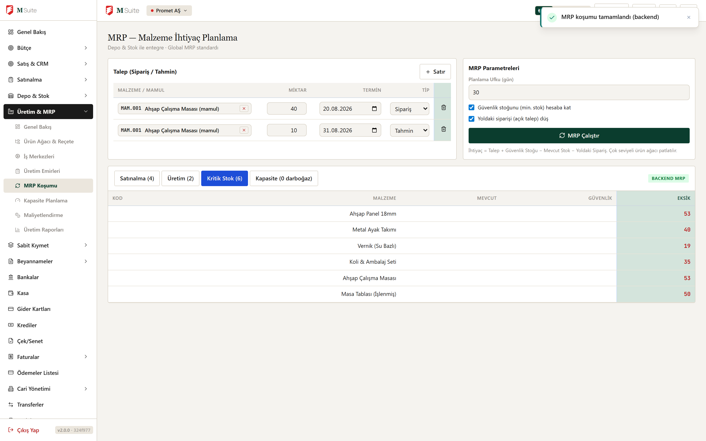
*Görsel 15 — Kritik stok listesi: mevcut, güvenlik ve eksik miktar*

**d) Kapasite** — önerilen üretimin iş merkezi yükü, ufuk kapasitesiyle karşılaştırılır. 30 günlük ufukta yükler düşüktür (0 darboğaz):

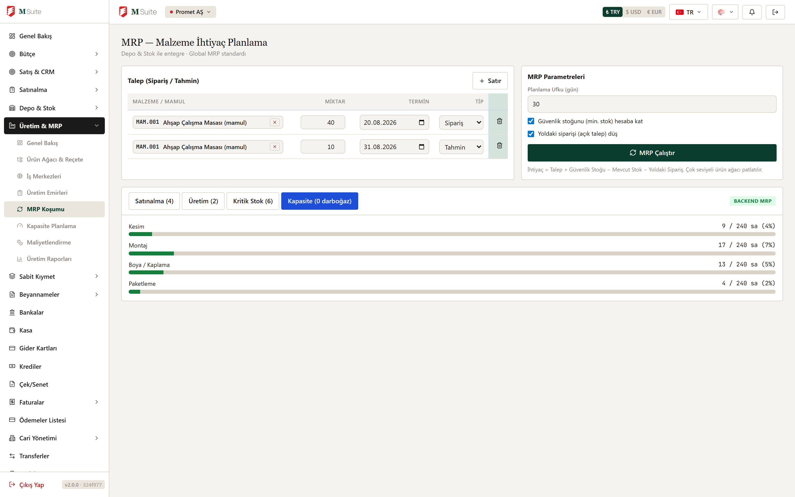
*Görsel 16 — 30 günlük ufukta kapasite yükleri: tüm iş merkezleri yeşil*

Ufku daraltarak sıkışıklığı test edebilirsiniz. Ufuk 2 güne çekilip koşum tekrarlanınca **Montaj %105 ile DARBOĞAZ** olur, Boya %80 ile sarıya döner:

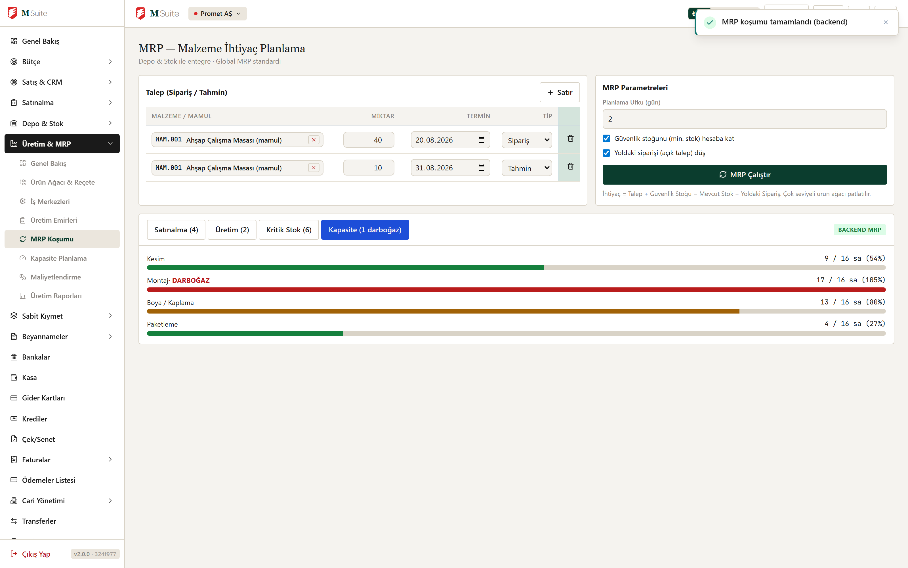
*Görsel 17 — Ufuk 2 gün: Montaj 17/16 sa (%105) kırmızı — talebi bu pencerede karşılamak için ek vardiya, alternatif rota veya termin ötelemesi gerekir*

### 8.4 Önerilerden aksiyona

MRP ekranından tek tıkla aksiyon alınır:

- **Talep Aç** (satınalma satırında) → Depo & Stok'ta **malzeme talebi** oluşturur. Bu talep beklemede/onaylı kaldığı sürece sonraki koşumlarda "yoldaki sipariş" olarak düşülür — aynı ihtiyaç iki kez önerilmez.

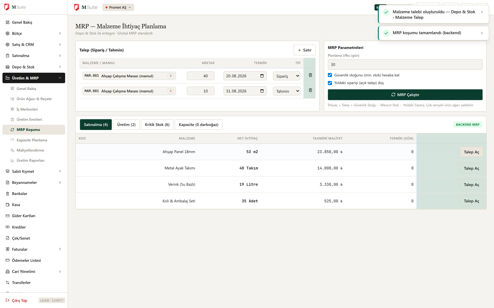
*Görsel 18 — Ahşap Panel için "Talep Aç": sağ üstte onay bildirimi*

- **Emir Aç** (üretim satırında) → önerilen miktar için **Planlandı** durumunda üretim emri oluşturur (malzeme rezervasyonu ve operasyon planı reçeteden otomatik türetilir).

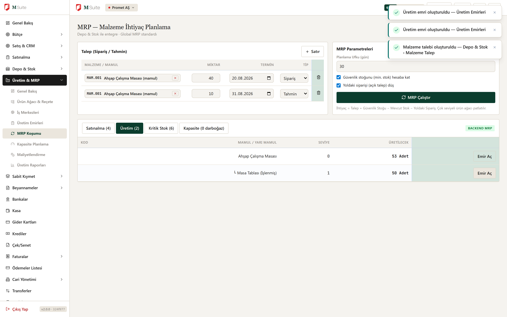
*Görsel 19 — Masa (53) ve tabla (50) önerilerinden emir açılması*

> Koşum geçmişi (son 50) saklanır; Genel Bakış her zaman **son koşumun** özetini gösterir.

---

## 9. Üretim Emirleri

**Üretim & MRP → Üretim Emirleri**, emirlerin yaşam döngüsünü yönetir. **Tablo** ve **Kanban** olmak üzere iki görünüm vardır.

### 9.1 Tablo görünümü

Kolonlar: Emir No (UE-YYYY-NNNN) · Mamul · Miktar · Öncelik · Planlanan başlangıç · **Kaynak (MRP / Manuel)** · Durum · İşlem.

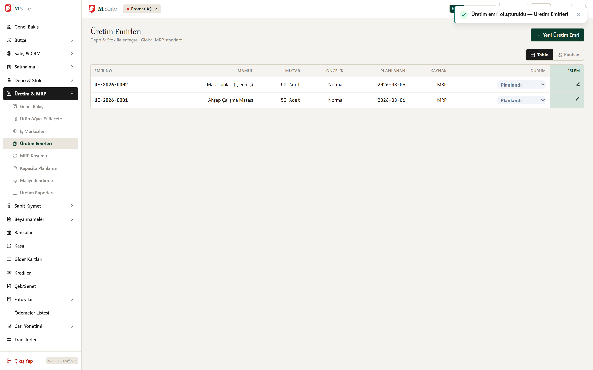
*Görsel 20 — MRP'den açılan iki emir Planlandı durumunda*

### 9.2 Manuel emir açma

**Yeni Üretim Emri** ile reçete + miktar seçilir; depo, öncelik ve planlanan başlangıç girilir. Pencerenin altında **Malzeme Rezervasyonu (otomatik)** önizlemesi, fire dahil gerekli hammaddeyi gösterir:

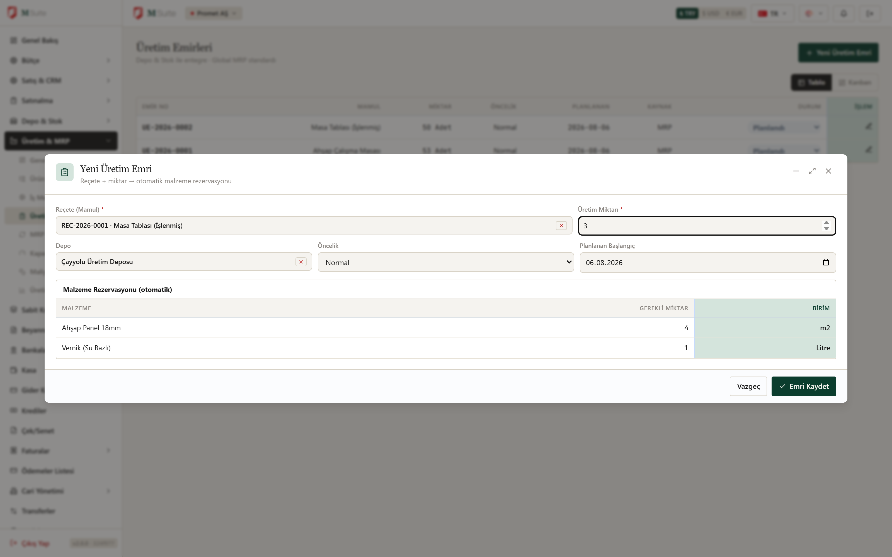
*Görsel 21 — 3 Adet Masa Tablası emri: rezervasyon önizlemesi 4 m² panel (1,2×3×1,05 fire dahil) + 1 L vernik*

### 9.3 Durum makinesi

```
Planlandı → Serbest Bırakıldı → Üretimde → Tamamlandı
     └──────────── İptal ────────────┘
```

- Durum, tablodaki renkli durum kutusundan veya kanbanda kartı sürükleyerek değiştirilir.
- **Tamamla** butonu yalnızca **Üretimde** durumunda görünür.
- **Tamamlanmış** emir yalnızca **İptal**'e çekilebilir; bu durumda stok hareketleri ters kayıtla geri alınır.

### 9.4 Kanban görünümü

Beş durum kolonu; kartlar sürükle-bırakla taşınır. Kart üzerinde kaynak (MRP/Manuel), miktar, öncelik ve planlanan tarih görünür:

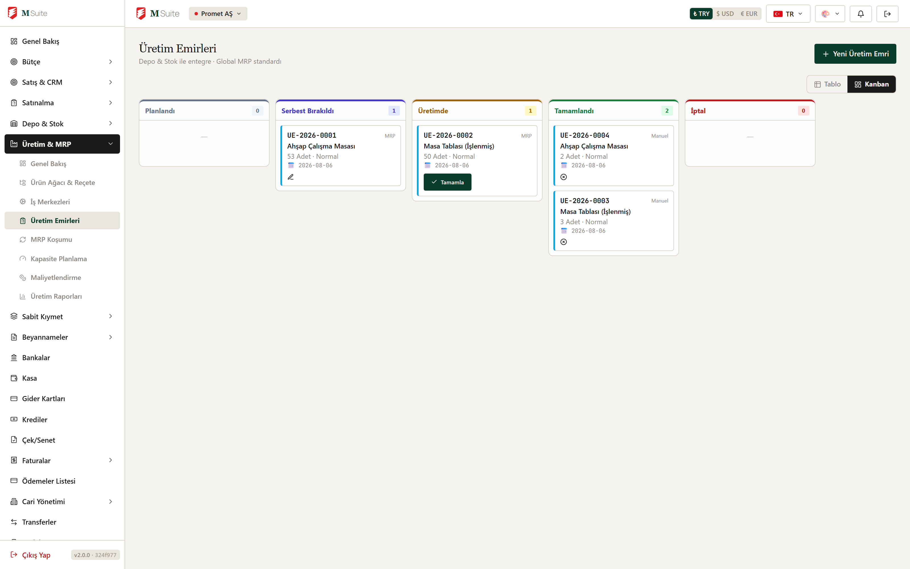
*Görsel 22 — Kanban: Serbest Bırakıldı (53 masa), Üretimde (50 tabla), Tamamlandı (manuel 3 tabla + 2 masa)*

### 9.5 Üretimi tamamlama — stok entegrasyonu

Senaryoda önce küçük manuel emirler yürütülür (3 tabla, ardından 2 masa):

1. Emri **Üretimde** durumuna çekin:

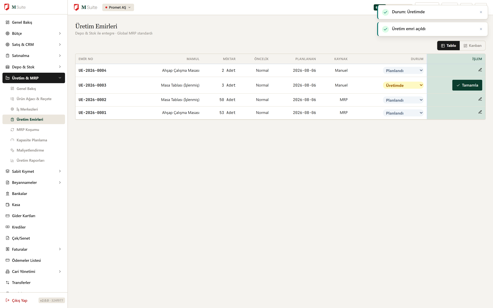
*Görsel 23 — Manuel tabla emri Üretimde; satırda "Tamamla" butonu belirdi*

2. **Tamamla**'ya basın. Sistem otomatik olarak:
   - Hammaddeleri stoktan düşer — **Üretime Verme** çıkış hareketleri (fire dahli gereksinim üzerinden, birim maliyetle),
   - Mamulü stoğa alır — **Üretimden Giriş** hareketi (reçete birim maliyetiyle),
   - Emri **Tamamlandı** yapar ve maliyet anlık görüntüsünü (cost snapshot) emre işler.

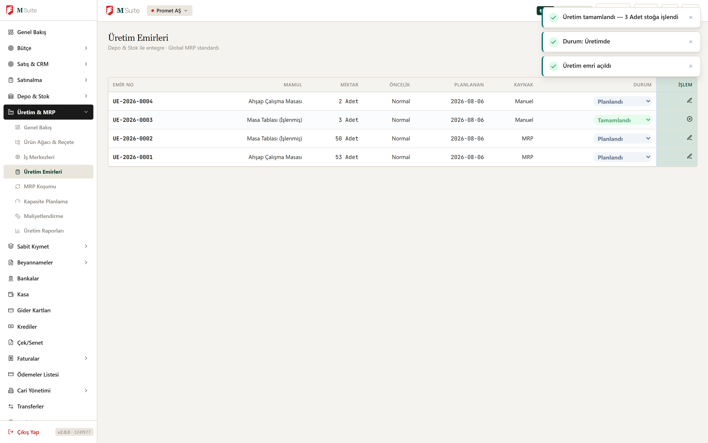
*Görsel 24 — "Üretim tamamlandı — 3 Adet stoğa işlendi" bildirimi*

Depo & Stok › Stok Durumu ekranında entegrasyonun sonucu birebir izlenir:

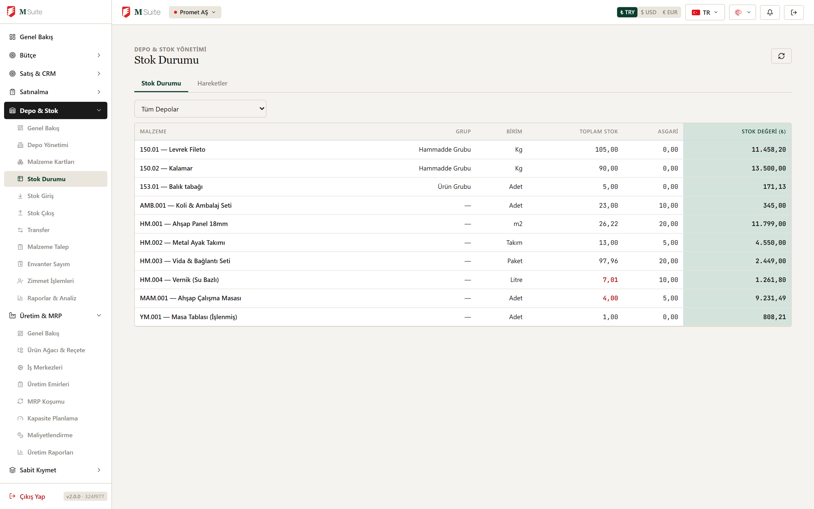
*Görsel 25 — Üretim sonrası stok: Panel 30→26,22 m² · Vernik 8→7,01 L · Vida 100→97,96 · Tabla 0→1 (3 üretildi, 2'si masaya tüketildi) · Masa 2→4*

> **Planlama disiplini:** Büyük MRP emirlerini hammadde tedariki tamamlanmadan **Üretimde**'ye çekmeyin; stok karşılığı olmayan tamamlama, negatif stoğa yol açabilir (malzeme kartındaki negatif stok kontrolü *engelle* değilse sistem izin verir).

---

## 10. Kapasite Planlama

**Üretim & MRP → Kapasite Planlama**, **açık üretim emirlerinin** (planlandı + serbest + üretimde) operasyon sürelerini iş merkezlerine yükler ve MRP parametrelerindeki ufka göre kullanılabilir kapasiteyle karşılaştırır:

- Yük (sa) = Σ [hazırlık + birim süre × miktar] / 60
- Kapasite (sa) = günlük saat × planlama ufku
- **>%80 sarı**, **>%100 kırmızı (darboğaz)**

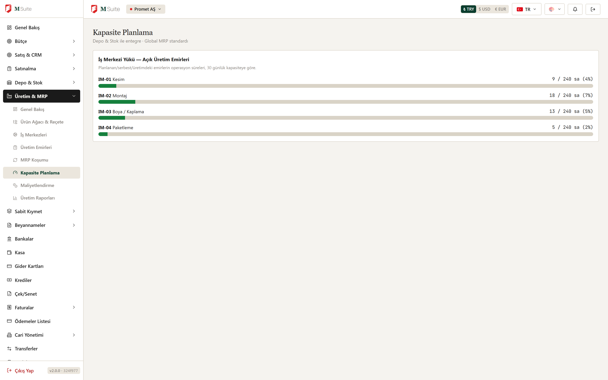
*Görsel 26 — Açık emir yüküne göre iş merkezi doluluk çubukları*

> **Uzman yorumu:** MRP kapasite sekmesi *öneri* yükünü, bu ekran *fiilî açık emir* yükünü gösterir. İkisini birlikte okuyun: önce MRP ile ihtiyacı doğrulayın, emirleri açtıktan sonra bu ekranda sıkışıklığı izleyin. Darboğazda seçenekleriniz: ek vardiya (günlük saati artırın), operasyonu alternatif iş merkezine taşıyın (reçetede rota değişikliği), fason, ya da terminleri öteleyin.

---

## 11. Maliyetlendirme

**Üretim & MRP → Maliyetlendirme**, seçilen reçetenin birim maliyet dökümünü verir:

- **Malzeme maliyeti:** bileşen miktarı (fire dahil) × birim fiyat. Yarı mamullerde fiyat, kendi reçetesinden **kademeli (rollup)** hesaplanır.
- **İşçilik maliyeti:** Σ [(hazırlık + birim süre × çıktı) / 60] × iş merkezi saat maliyeti.
- **Genel gider:** (malzeme + işçilik) × seçilen %.

Senaryo (Ahşap Çalışma Masası, %10 genel gider):

| Kalem | Tutar |
|---|---|
| Malzeme (tabla 808,21 + ayak 350,00 + vida 25,50 + koli 15,00) | 1.198,71 ₺ |
| İşçilik (Montaj + Paketleme) | 88,33 ₺ |
| Genel gider (%10) | 128,70 ₺ |
| **Birim maliyet** | **1.415,74 ₺** |

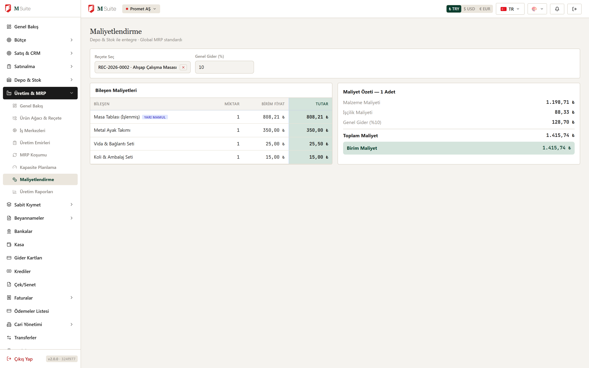
*Görsel 27 — Masa reçetesinin maliyet dökümü; Masa Tablası satırı "YARI MAMUL" rozetli ve alt reçetesinden fiyatlanmış*

> Genel gider yüzdesini değiştirerek fiyatlama senaryoları deneyebilirsiniz; reçete listesindeki ve MRP'deki maliyetler de aynı yüzdeyi kullanır.

---

## 12. Üretim Raporları

**Üretim & MRP → Üretim Raporları** dört sekmeden oluşur:

**Fire Raporu** — tamamlanan emirlerde üretilen/fire miktarı ve fire %:

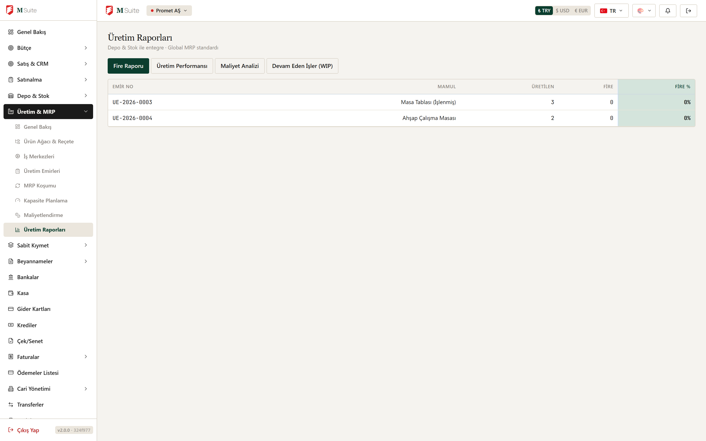
*Görsel 28 — Fire raporu*

**Üretim Performansı** — tüm emirlerde planlanan/üretilen ve gerçekleşme %:

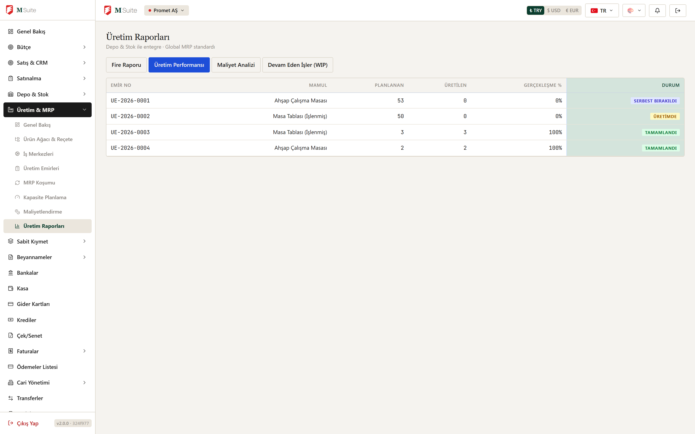
*Görsel 29 — Plan-gerçekleşme karşılaştırması*

**Maliyet Analizi** — tüm reçetelerin malzeme/işçilik/genel gider/birim maliyet dökümü:

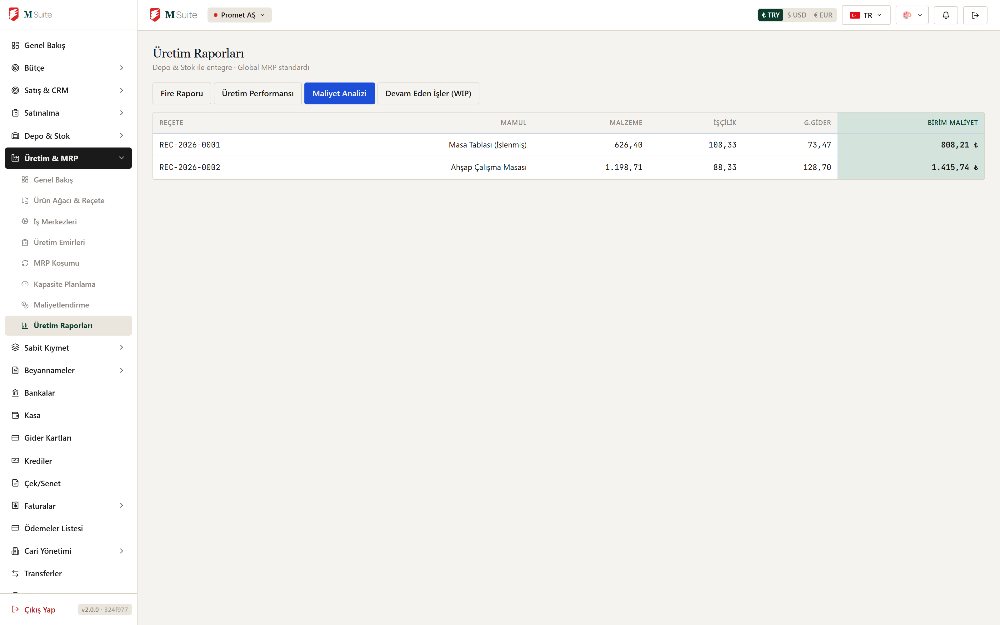
*Görsel 30 — Reçete bazlı maliyet analizi*

**Devam Eden İşler (WIP)** — açık emirler ve rezerve malzeme kalem sayısı:

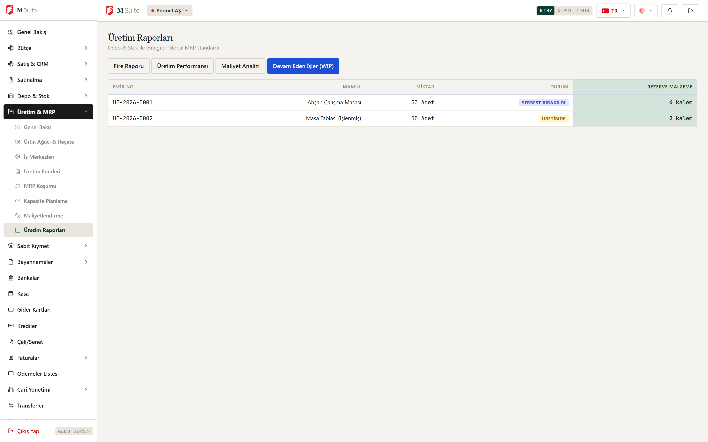
*Görsel 31 — WIP: kapanmamış emirlerin anlık durumu*

---

## 13. Uçtan Uca Senaryo Özeti

| # | Adım | Ekran | Görsel |
|---|---|---|---|
| 1 | Malzeme kartlarını tanımla (7 kart) | Depo & Stok › Malzeme Kartları | 3 |
| 2 | Açılış stoklarını gir | Depo & Stok › Stok Giriş | 4 |
| 3 | İş merkezlerini doğrula / ekle | Üretim › İş Merkezleri | 7–8 |
| 4 | Yarı mamul reçetesi (tabla) | Üretim › Ürün Ağacı & Reçete | 9 |
| 5 | Nihai mamul reçetesi (masa) | Üretim › Ürün Ağacı & Reçete | 10–11 |
| 6 | Talep gir: 40 sipariş + 10 tahmin | Üretim › MRP Koşumu | 12 |
| 7 | MRP çalıştır, 4 sekmeyi incele | Üretim › MRP Koşumu | 13–17 |
| 8 | Panel için satınalma talebi aç | MRP › Satınalma › Talep Aç | 18 |
| 9 | Masa + tabla üretim emri aç | MRP › Üretim › Emir Aç | 19–20 |
| 10 | Manuel deneme emirleri (3 tabla, 2 masa) | Üretim › Üretim Emirleri | 21 |
| 11 | Emirleri Üretimde → Tamamla | Üretim › Üretim Emirleri | 23–24 |
| 12 | Stok/rapor/kokpit kontrolü | Stok Durumu · Raporlar · Genel Bakış | 25–31, 6 |

**Stok değişim özeti (önce → sonra):** Panel 30→26,22 m² · Vernik 8→7,01 L · Vida 100→97,96 · Ayak 15→13 · Koli 25→23 · Tabla 0→1 · Masa 2→4.

---

## 14. İpuçları ve En İyi Uygulamalar

1. **Kod sistematiği kurun** (MAM/YM/HM/AMB gibi) — arama, raporlama ve MRP çıktısının okunması kolaylaşır.
2. **Fire yüzdelerini gerçek verilerle güncelleyin.** Fire Raporu'ndaki gerçekleşmeleri periyodik olarak reçetelere geri işleyin; MRP'nin hammadde önerisi ancak fire doğruysa doğrudur.
3. **Asgari (güvenlik) stok değerlerini bilinçli koyun.** 0 bırakılırsa MRP yalnız net talebe bakar; kritik hammaddede tedarik dalgalanmasını emmek için güvenlik stoğu şarttır.
4. **Ufku talep dönemine göre seçin.** Kapasite değerlendirmesi ufka bölünür; 30 günlük ufukta görünmeyen sıkışıklık 2–5 günlük pencerede darboğaz olabilir (Görsel 16 vs 17). Kısa ufuklu ikinci bir koşum "acil pencere" testi olarak faydalıdır.
5. **Tahmini siparişten ayrı girin.** İkisi de ihtiyaca girer ama tahmin oranını bilinçli yönetin; tahmin ağırlıklı planlarda güvenlik stoğuna yaslanmak yerine terminleri kademelendirin.
6. **Her önemli stok/talep değişiminden sonra MRP'yi yeniden koşun.** Koşum saniyeler sürer; "Talep Aç" ile açtığınız talepler yoldaki sipariş olarak otomatik düşüleceği için mükerrer öneri oluşmaz.
7. **Emir disiplinine uyun:** Planlandı (onay bekliyor) → Serbest (üretime hazır, malzeme tamam) → Üretimde (fiilen başladı). Stok yalnız tamamlanınca işlendiği için, durumları gerçek zamanlı güncellemek WIP ve kapasite raporlarının doğruluğunu belirler.
8. **Maliyetleri canlı tutun.** Alış fiyatları değiştiğinde malzeme kartını güncelleyin; alış fiyatı girilmeyen kalemlerde sistemin hareketli ortalaması devrededir — düzenli stok girişi yapılan kalemlerde bu genellikle yeterlidir.
9. **Tamamlanan emri bozmayın, iptal edin.** Yanlış tamamlanan emirde İptal, tüm stok hareketlerini ters kayıtla geri alır — elle düzeltme kaydı atmayın.

---

## 15. Sık Sorulan Sorular

**S: Sonuç kartında "Yerel Hesap" rozeti görüyorum, ne demek?**
Sunucudaki MRP motoruna ulaşılamadı; hesap tarayıcıda aynı sözleşmeyle yapıldı. Sonuçlar kullanılabilir; kalıcı ortamda backend bağlantısını kontrol edin.

**S: "Önce en az bir talep satırı ekleyin" uyarısı alıyorum.**
MRP koşumu için en az bir talep (sipariş/tahmin) satırı gerekir — bkz. 8.1.

**S: "Önce Ürün Ağacı ekranından reçete ekleyin" uyarısı görüyorum.**
Üretim emri reçetesiz açılamaz; önce mamulün reçetesini tanımlayın (Bölüm 7).

**S: Emri tamamlarken "önce depo tanımlayın" uyarısı geldi.**
Stok hareketleri için en az bir depo gerekir — Depo & Stok › Depo Yönetimi'nden ekleyin.

**S: Satınalma önerisinde Termin (gün) hep 0.**
Tedarik süresi alanı henüz malzeme kartında yönetilmiyor; kolon bu yüzden 0 kalır. Tedarik sürelerini satınalma tarafında ayrıca planlayın.

**S: Üretimi tamamladım, stok eksiye düştü.**
Malzeme kartındaki negatif stok kontrolü "izin ver" modundaysa sistem uyarmaz. Kritik hammaddede bu alanı "engelle" yapın ve tamamlamadan önce Stok Durumu'nu kontrol edin.

**S: MRP önerileri bir önceki koşuma göre azaldı, neden?**
Büyük olasılıkla "Talep Aç" ile oluşturduğunuz malzeme talepleri **yoldaki sipariş** olarak düşülüyor ya da bu arada stok/talep değişti. Parametre kutusundaki "yoldaki siparişi düş" seçeneğine bakın.

**S: Aynı mamule iki reçete girdim; hangisi kullanılıyor?**
Durumu *aktif* olan ilk reçete. Alternatifleri Taslak/Pasif tutun.

---

## Ek A — Yetki (RBAC) Matrisi

| Kaynak | Ekran | Eylemler |
|---|---|---|
| production.dashboard | Genel Bakış | görüntüle |
| production.bom | Ürün Ağacı & Reçete | görüntüle, oluştur, güncelle, sil, dışa aktar |
| production.workcenters | İş Merkezleri / Kapasite | görüntüle, oluştur, güncelle, sil |
| production.orders | Üretim Emirleri | görüntüle, oluştur, güncelle, sil |
| production.mrp | MRP Koşumu | görüntüle, çalıştır (oluştur) |
| production.cost | Maliyetlendirme | görüntüle, dışa aktar |
| production.reports | Üretim Raporları | görüntüle, dışa aktar |

Yetkiler **Ayarlar › Yetki Yönetimi** ekranından rol veya kullanıcı bazında atanır. Ekran butonları (Yeni Reçete, Emir Aç, Tamamla…) yalnızca ilgili eyleme yetkili kullanıcılara görünür.

---

*Bu kılavuz M Suite Üretim & MRP modülü için hazırlanmıştır. Görseller 06.08.2026 tarihli canlı ortamdan alınmıştır.*
