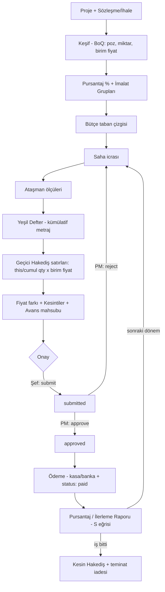

# Uçtan Uca Şantiye Yönetim Modülü — PRD & Sistem Mimarisi (v1)

> Hazırlayan: Yazılım TL / Sistem Mimarı (ekip)
> Hedef: Prometa One platformuna, mevcut Clean Architecture + RBAC mimarisine tam entegre, hem özel projeleri hem de KİK (Kamu İhale Kanunu) mevzuatına uyumlu ihaleli işleri kapsayan, **Keşiften Hakedişe** uçtan uca bir şantiye yönetim modülü.
> Modül kod adı: `construction` (backend `/v1/construction`, frontend `modules/construction-site`, DB `cs_` öneki, RBAC `construction.*`).

---

## 1. Ürün Gereksinim Dokümanı (PRD)

### 1.1 Amaç ve Kapsam

İnşaat/taahhüt firmasının bir projeyi **keşif (metraj + birim fiyat) aşamasından**, **pursantaj (ilerleme ağırlığı) tanımına**, oradan **yeşil defter/ataşman ile ölçülen ilerlemeye** ve nihayetinde **işveren ve taşeron hakedişlerine** kadar tek bir veri omurgası üzerinde yönetmesini sağlar. Aynı omurga; harcama/finans, malzeme/depo ve işgücü/makine parkı verilerini şantiye-proje kırılımında toplar.

**Kapsam içi:** Özel projeler (bütçe/maliyet odaklı) + ihaleli işler (sözleşme, KİK, idari/teknik şartname, fiyat farkı, kesintiler). 6 ana bileşen (aşağıda).
**Kapsam dışı (v1):** EKAP entegrasyonu (manuel veri girişi ile), e-Defter/e-Fatura entegrasyonu (mevcut muhasebe modülüne bırakılır), CAD/BIM entegrasyonu.

### 1.2 Hedefler ve Başarı Kriterleri

| Hedef                           | Ölçüt (v1)                                                                                                               |
| ------------------------------- | ------------------------------------------------------------------------------------------------------------------------ |
| Keşif → Hakediş izlenebilirliği | Her hakediş satırı keşif (BoQ) satırına ve metraja kadar geriye izlenebilir                                              |
| KİK uyumlu geçici/kesin hakediş | Yeşil defter, yapılan işler listesi, fiyat farkı ve standart kesintiler (SGK, stopaj, teminat, avans mahsubu) hesaplanır |
| Pursantaj usulü ilerleme        | Proje/grup/poz bazında fiziki gerçekleşme % otomatik hesaplanır                                                          |
| Çoklu şantiye stok              | Şantiyeler arası transfer + fire oranı + talep/onay                                                                      |
| Maliyet kontrolü                | Bütçe (keşif) vs gerçekleşen (harcama+puantaj+makine) sapma raporu                                                       |
| Mevcut sisteme entegrasyon      | RBAC, cari (vendors), fatura ve org birimleri yeniden kullanılır; yeni izin modeli icat edilmez                          |

### 1.3 Persona / Kullanıcılar

- **Proje Müdürü (PM):** Sözleşme/bütçe sahibi, işveren hakedişini onaylar, çoklu şantiye görür.
- **Şantiye Şefi:** Saha operasyonu — metraj, puantaj, malzeme talebi, makine logu, hakediş hazırlama.
- **Muhasebe:** Harcama, fatura eşleştirme, kesinti/ödeme, hakediş finansal kontrolü, dışa aktarım.
- **İşveren (dış):** Salt-okunur portal — kendi işveren hakedişi ve ilerleme raporu; (opsiyonel) onay.
- **Taşeron (dış):** Salt-okunur — kendi taşeron hakedişi ve yapılan işler listesi.

### 1.4 Ana Bileşenler (Epics)

**E1 — Proje ve İhale Yönetimi**

- Proje tipi: `private` (özel) | `public_tender` (ihaleli).
- İhaleli işlerde: EKAP/İKN no, ihale usulü, yaklaşık maliyet, sözleşme bedeli, sözleşme tarihi/süresi, iş artışı (%), idari & teknik şartname dokümanları, geçici/kesin teminat.
- Sözleşmeler: `employer` (işverenle — biz yüklenici) ve `subcontractor` (taşeronla — biz idare). Cari = mevcut `vendors` (alıcı/satıcı) tablosu.

**E2 — Keşif ve Pursantaj Yönetimi**

- Poz katalog (firma genel + projeye özel): birim fiyat pozları (ör. Çevre-Şehircilik birim fiyatları veya özel pozlar).
- Keşif (BoQ) = sözleşmeye bağlı iş kalemleri: poz, açıklama, birim, miktar, birim fiyat, tutar.
- Pursantaj: her kalemin sözleşme bedeline oranı (% ağırlık). Grup (imalat grubu) bazında roll-up.
- Bütçe eşleştirme: keşif tutarı = bütçe; gerçekleşen ile karşılaştırılır.

**E3 — Harcama ve Finans Yönetimi**

- Şantiye giderleri, faturalar (mevcut `invoices` ile bağ), avanslar, kasa/banka hareketleri, tedarikçi ödemeleri.
- Maliyet, projeye ve (opsiyonel) keşif kalemine/imalat grubuna dağıtılır → gerçekleşen maliyet.

**E4 — Hakediş ve İlerleme Takibi**

- İşveren hakedişi (gelir) + taşeron hakedişi (gider), geçici/kesin.
- Yeşil defter (kümülatif metraj), ataşman (ölçü detay sayfaları/çizim ekleri), yapılan işler listesi (kümülatif miktar × birim fiyat).
- Fiyat farkı (eskalasyon), kesintiler, avans mahsubu, teminat kesintisi, gecikme cezası.
- Pursantaj usulü ilerleme raporu.

**E5 — Malzeme ve Depo Yönetimi**

- Malzeme master, şantiye depoları, stok, giriş/çıkış/transfer hareketleri.
- Şantiyeler arası transfer, fire oranı (planlanan/gerçekleşen), malzeme talep + onay.

**E6 — İş Gücü ve Makine Parkı**

- Personel puantajı (HR `employees` ile bağ) + taşeron işçi takibi.
- Makine parkı: çalışma saatleri, yakıt, bakım giderleri; makine maliyeti projeye/kaleme dağıtılır.

### 1.5 Fonksiyonel Olmayan Gereksinimler

- **Multi-tenant:** her tabloda `company_id`; tüm sorgular `company_id` filtreli.
- **Para:** `NUMERIC(20,2)`, `currency_code` ENUM (TRY/USD/EUR); miktar `NUMERIC(20,3)`.
- **Audit:** `created_by`, `created_at`, `updated_at` (trigger), hakediş/onay için durum geçiş geçmişi tablosu.
- **Yetki:** mevcut RBAC; hakediş/talep onayı için `approve` aksiyonu eklenir (tek katalog genişletmesi).
- **İzlenebilirlik:** her hakediş satırı → BoQ satırı → metraj/ataşman zinciri.
- **Tutarlılık:** çok tablolu yazımlar `Pool.connect()` + BEGIN/COMMIT/ROLLBACK (veya UnitOfWork).

---

## 2. Sistem Mimarisi

### 2.1 Yerleşim (mevcut kalıbın birebir kopyası — `purchasing` şablonu)

**Backend** — `api-server/src/modules/construction/`

```
construction/
├── application/
│   ├── dto/            (ProjectDtos, BoqDtos, ProgressDtos, MaterialDtos, LaborDtos …)
│   ├── ports/          (Clock, ProjectRepository, ContractRepository, BoqRepository,
│   │                    ProgressPaymentRepository, MaterialRepository, TimesheetRepository,
│   │                    MachineRepository, ConstructionUnitOfWork)
│   └── useCases/       (ProjectUseCases, ContractUseCases, BoqUseCases,
│                        ProgressPaymentUseCases, MaterialUseCases, LaborUseCases …)
├── domain/
│   ├── entities/       (Project, Contract, Boq, BoqLine, ProgressPayment, MeasurementBook,
│   │                    Attachment, MaterialStock, StockMovement, Timesheet, Machine …)
│   ├── valueObjects/   (ProjectType, ContractType, ProgressStatus, DeductionType, Pursantaj …)
│   └── errors/         (ConstructionErrors)
├── infrastructure/persistence/  (Pg*Repository, Queryable, unitOfWork/PgConstructionUnitOfWork)
├── presentation/       (routes.ts, errorMapping.ts)
└── index.ts            (registerConstructionModule(pool) → Hono router)
```

Mount: `src/index.ts` → `import { registerConstructionModule }` → `const m = registerConstructionModule(pool)` → `v1.route('/construction', m)`.

**Frontend** — `frontend/src/modules/construction-site/` (`purchasing` modülü şablonu)

```
application/dto + ports(AuthTokenProvider, ConstructionApi)
infrastructure/api/ConstructionApiClient.ts   (fetch + Bearer, /v1/construction/*)
presentation/components + hooks
demo/ConstructionModule.tsx                    (views=[…] ile scoped mount)
index.ts (barrel)
```

App.jsx: yeni menü grubu `construction` (ray + panel) + `view === "cs_*"` koşullu render.

### 2.2 Katmanlama

- **Domain:** immutable entity `static create()` + iş kuralları (durum geçişleri, pursantaj/hakediş hesapları saf fonksiyon olarak burada).
- **Application:** use-case'ler port'lara bağımlı; `Clock` enjekte; numara üretimi (HAK-2026-0001 vb.).
- **Infrastructure:** `Pg*Repository implements Port`, ham SQL, satır→entity map; çok tablolu işlemlerde `Pool` + transaction.
- **Presentation:** Hono router, `authMiddleware`, Zod doğrulama, domain hata → HTTP map (`errorMapping.ts`).

### 2.3 Entegrasyon Noktaları (yeniden kullanım, kopyalama yok)

| İhtiyaç                          | Mevcut varlık                                                       |
| -------------------------------- | ------------------------------------------------------------------- |
| Cari (işveren/taşeron/tedarikçi) | `vendors` (`cari_class`, `account_code`)                            |
| Fatura                           | `invoices` (şantiye gideri faturaları buraya bağlanır)              |
| Personel                         | HR `employees` (puantaj personeli)                                  |
| Departman/org birimi             | HR `org_units` / `departments` (proje–org bağı)                     |
| Yetki                            | `access_custom_roles` + `access_role_grants` + `PermissionResolver` |
| Para                             | finance `Money` value object kalıbı                                 |

> **Mimari karar (onay gerektirir):** Şantiye giderleri ana defter/cashflow ile nasıl bağlanacak? İki seçenek: (a) `cs_expenses` kendi tablosu + opsiyonel `invoice_id` FK ile mevcut faturaya bağ; (b) doğrudan finance `invoices` üzerine `project_id`/`boq_line_id` kolonları ekleyip şantiye giderini fatura olarak tutmak. v1 önerisi: **(a)** — modül izolasyonunu korur, Strangler Fig'e uygundur.

---

## 3. Veri Tabanı Şeması (genişletilebilir, `cs_` öneki)

Konvansiyon: PK `BIGSERIAL`, `company_id INT NOT NULL REFERENCES companies(id) ON DELETE CASCADE`, para `NUMERIC(20,2)`, miktar `NUMERIC(20,3)`, oran/yüzde `NUMERIC(7,4)`, `created_by`, `created_at/updated_at` + `trg_updated_at` trigger, status alanları PostgreSQL ENUM. Migration dosyaları domain'e göre bölünür: `023_cs_projects.sql` … `028_cs_labor.sql`.

### 3.1 ENUM tipleri

```sql
CREATE TYPE cs_project_type    AS ENUM ('private','public_tender');
CREATE TYPE cs_project_status  AS ENUM ('planning','active','suspended','completed','closed');
CREATE TYPE cs_contract_party  AS ENUM ('employer','subcontractor');   -- işveren / taşeron
CREATE TYPE cs_progress_kind   AS ENUM ('employer','subcontractor');   -- hakediş yönü
CREATE TYPE cs_progress_type   AS ENUM ('interim','final');            -- geçici / kesin
CREATE TYPE cs_progress_status AS ENUM ('draft','submitted','approved','rejected','paid','cancelled');
CREATE TYPE cs_deduction_kind  AS ENUM ('retention','advance_offset','sgk','income_tax','stoppage','penalty','price_diff','other');
CREATE TYPE cs_stock_move_kind AS ENUM ('in','out','transfer','adjust','waste');     -- giriş/çıkış/transfer/sayım/fire
CREATE TYPE cs_mreq_status     AS ENUM ('draft','submitted','approved','rejected','fulfilled','cancelled');
CREATE TYPE cs_machine_kind    AS ENUM ('owned','rented','subcontractor');
```

### 3.2 E1 — Proje & İhale

```sql
-- 023_cs_projects.sql
CREATE TABLE cs_projects (
  id              BIGSERIAL PRIMARY KEY,
  company_id      INT NOT NULL REFERENCES companies(id) ON DELETE CASCADE,
  code            VARCHAR(40)  NOT NULL,
  name            VARCHAR(300) NOT NULL,
  project_type    cs_project_type   NOT NULL DEFAULT 'private',
  status          cs_project_status NOT NULL DEFAULT 'planning',
  org_unit_id     INT,                          -- HR org birimi (loose link)
  manager_user_id INT REFERENCES users(id) ON DELETE SET NULL,
  location        VARCHAR(500),
  start_date      DATE,
  planned_end     DATE,
  budget_amount   NUMERIC(20,2) NOT NULL DEFAULT 0 CHECK (budget_amount >= 0),
  currency        currency_code NOT NULL DEFAULT 'TRY',
  active          BOOLEAN NOT NULL DEFAULT TRUE,
  created_by      INT REFERENCES users(id) ON DELETE SET NULL,
  created_at      TIMESTAMPTZ NOT NULL DEFAULT NOW(),
  updated_at      TIMESTAMPTZ NOT NULL DEFAULT NOW(),
  UNIQUE (company_id, code)
);

CREATE TABLE cs_sites (                          -- bir proje altında 1+ fiziksel şantiye
  id          BIGSERIAL PRIMARY KEY,
  company_id  INT NOT NULL REFERENCES companies(id) ON DELETE CASCADE,
  project_id  BIGINT NOT NULL REFERENCES cs_projects(id) ON DELETE CASCADE,
  code        VARCHAR(40) NOT NULL,
  name        VARCHAR(300) NOT NULL,
  location    VARCHAR(500),
  active      BOOLEAN NOT NULL DEFAULT TRUE,
  created_at  TIMESTAMPTZ NOT NULL DEFAULT NOW(),
  updated_at  TIMESTAMPTZ NOT NULL DEFAULT NOW(),
  UNIQUE (company_id, project_id, code)
);

CREATE TABLE cs_contracts (
  id              BIGSERIAL PRIMARY KEY,
  company_id      INT NOT NULL REFERENCES companies(id) ON DELETE CASCADE,
  project_id      BIGINT NOT NULL REFERENCES cs_projects(id) ON DELETE CASCADE,
  party_kind      cs_contract_party NOT NULL,        -- employer | subcontractor
  vendor_id       BIGINT REFERENCES vendors(id) ON DELETE RESTRICT,  -- karşı taraf cari
  contract_no     VARCHAR(60) NOT NULL,
  title           VARCHAR(300) NOT NULL,
  amount          NUMERIC(20,2) NOT NULL DEFAULT 0 CHECK (amount >= 0),
  currency        currency_code NOT NULL DEFAULT 'TRY',
  sign_date       DATE,
  start_date      DATE,
  end_date        DATE,
  retention_pct   NUMERIC(7,4) NOT NULL DEFAULT 0,   -- teminat/kesinti oranı
  advance_pct     NUMERIC(7,4) NOT NULL DEFAULT 0,   -- avans oranı
  price_diff_on   BOOLEAN NOT NULL DEFAULT FALSE,    -- fiyat farkı uygulanır mı
  created_by      INT REFERENCES users(id) ON DELETE SET NULL,
  created_at      TIMESTAMPTZ NOT NULL DEFAULT NOW(),
  updated_at      TIMESTAMPTZ NOT NULL DEFAULT NOW(),
  UNIQUE (company_id, contract_no)
);

CREATE TABLE cs_tender_info (                        -- yalnızca public_tender
  contract_id     BIGINT PRIMARY KEY REFERENCES cs_contracts(id) ON DELETE CASCADE,
  ikn             VARCHAR(40),                        -- EKAP İhale Kayıt No
  procedure       VARCHAR(60),                        -- ihale usulü (açık, pazarlık …)
  approx_cost     NUMERIC(20,2),                      -- yaklaşık maliyet
  tender_date     DATE,
  work_increase_pct NUMERIC(7,4) DEFAULT 0,           -- iş artışı tavanı (KİK %10/%20)
  perf_bond_pct   NUMERIC(7,4) DEFAULT 0,             -- kesin teminat oranı
  notes           TEXT
);

CREATE TABLE cs_contract_documents (                 -- idari/teknik şartname, ek belgeler
  id           BIGSERIAL PRIMARY KEY,
  company_id   INT NOT NULL REFERENCES companies(id) ON DELETE CASCADE,
  contract_id  BIGINT NOT NULL REFERENCES cs_contracts(id) ON DELETE CASCADE,
  doc_type     VARCHAR(40) NOT NULL,                  -- idari_sartname | teknik_sartname | sozlesme | ek
  title        VARCHAR(300) NOT NULL,
  file_url     VARCHAR(1000),
  created_at   TIMESTAMPTZ NOT NULL DEFAULT NOW()
);
```

### 3.3 E2 — Keşif & Pursantaj

```sql
-- 024_cs_boq.sql
CREATE TABLE cs_poz_catalog (                        -- birim fiyat / poz katalog
  id          BIGSERIAL PRIMARY KEY,
  company_id  INT NOT NULL REFERENCES companies(id) ON DELETE CASCADE,
  poz_no      VARCHAR(40) NOT NULL,                   -- ör. Y.16.050/01
  name        VARCHAR(500) NOT NULL,
  unit        VARCHAR(20)  NOT NULL,                  -- m3, m2, ton, ad …
  unit_price  NUMERIC(20,2) NOT NULL DEFAULT 0,
  source      VARCHAR(40),                            -- CSB | kurum | ozel
  year        INT,
  active      BOOLEAN NOT NULL DEFAULT TRUE,
  created_at  TIMESTAMPTZ NOT NULL DEFAULT NOW(),
  updated_at  TIMESTAMPTZ NOT NULL DEFAULT NOW(),
  UNIQUE (company_id, poz_no, year)
);

CREATE TABLE cs_boq_groups (                          -- imalat grupları (pursantaj roll-up)
  id          BIGSERIAL PRIMARY KEY,
  company_id  INT NOT NULL REFERENCES companies(id) ON DELETE CASCADE,
  contract_id BIGINT NOT NULL REFERENCES cs_contracts(id) ON DELETE CASCADE,
  code        VARCHAR(40) NOT NULL,
  name        VARCHAR(300) NOT NULL,
  sort_order  INT NOT NULL DEFAULT 0
);

CREATE TABLE cs_boq_lines (                           -- keşif satırı (iş kalemi)
  id            BIGSERIAL PRIMARY KEY,
  company_id    INT NOT NULL REFERENCES companies(id) ON DELETE CASCADE,
  contract_id   BIGINT NOT NULL REFERENCES cs_contracts(id) ON DELETE CASCADE,
  group_id      BIGINT REFERENCES cs_boq_groups(id) ON DELETE SET NULL,
  poz_id        BIGINT REFERENCES cs_poz_catalog(id) ON DELETE SET NULL,
  line_no       INT NOT NULL DEFAULT 1,
  poz_no        VARCHAR(40),
  description   VARCHAR(500) NOT NULL,
  unit          VARCHAR(20)  NOT NULL,
  quantity      NUMERIC(20,3) NOT NULL DEFAULT 0 CHECK (quantity >= 0),
  unit_price    NUMERIC(20,2) NOT NULL DEFAULT 0 CHECK (unit_price >= 0),
  amount        NUMERIC(20,2) NOT NULL DEFAULT 0,     -- quantity*unit_price (uygulamada hesap)
  pursantaj_pct NUMERIC(9,6)  NOT NULL DEFAULT 0,     -- bu kalemin sözleşme bedeline % ağırlığı
  created_at    TIMESTAMPTZ NOT NULL DEFAULT NOW(),
  updated_at    TIMESTAMPTZ NOT NULL DEFAULT NOW(),
  UNIQUE (company_id, contract_id, line_no)
);
CREATE INDEX idx_cs_boq_lines_contract ON cs_boq_lines(contract_id);
```

> Pursantaj kuralı: `pursantaj_pct = amount / Σ(amount)`. Sözleşme bazında Σ pursantaj = 100 (uygulama doğrular, küçük yuvarlama toleransı ile).

### 3.4 E4 — Hakediş, Yeşil Defter, Ataşman

```sql
-- 025_cs_progress.sql
CREATE TABLE cs_progress_payments (                   -- HAKEDİŞ başlığı
  id              BIGSERIAL PRIMARY KEY,
  company_id      INT NOT NULL REFERENCES companies(id) ON DELETE CASCADE,
  contract_id     BIGINT NOT NULL REFERENCES cs_contracts(id) ON DELETE RESTRICT,
  hakedis_no      VARCHAR(40) NOT NULL,               -- HAK-2026-0001
  kind            cs_progress_kind   NOT NULL,        -- employer | subcontractor
  ptype           cs_progress_type   NOT NULL DEFAULT 'interim',
  seq_no          INT NOT NULL,                       -- kaçıncı hakediş
  period_start    DATE,
  period_end      DATE,
  status          cs_progress_status NOT NULL DEFAULT 'draft',
  -- tutar özetleri (uygulamada hesaplanır, denetim için saklanır)
  gross_this      NUMERIC(20,2) NOT NULL DEFAULT 0,   -- bu dönem yapılan iş tutarı
  gross_cumul     NUMERIC(20,2) NOT NULL DEFAULT 0,   -- kümülatif yapılan iş
  price_diff      NUMERIC(20,2) NOT NULL DEFAULT 0,   -- fiyat farkı
  deductions_tot  NUMERIC(20,2) NOT NULL DEFAULT 0,
  net_payable     NUMERIC(20,2) NOT NULL DEFAULT 0,   -- ödenecek net
  currency        currency_code NOT NULL DEFAULT 'TRY',
  submitted_at    TIMESTAMPTZ,
  approved_at     TIMESTAMPTZ,
  approved_by     INT REFERENCES users(id) ON DELETE SET NULL,
  created_by      INT REFERENCES users(id) ON DELETE SET NULL,
  created_at      TIMESTAMPTZ NOT NULL DEFAULT NOW(),
  updated_at      TIMESTAMPTZ NOT NULL DEFAULT NOW(),
  UNIQUE (company_id, hakedis_no),
  UNIQUE (contract_id, kind, seq_no)
);
CREATE INDEX idx_cs_pp_contract_status ON cs_progress_payments(contract_id, status);

CREATE TABLE cs_progress_lines (                      -- hakediş satırı = BoQ satırı bazında
  id            BIGSERIAL PRIMARY KEY,
  progress_id   BIGINT NOT NULL REFERENCES cs_progress_payments(id) ON DELETE CASCADE,
  boq_line_id   BIGINT NOT NULL REFERENCES cs_boq_lines(id) ON DELETE RESTRICT,
  prev_qty      NUMERIC(20,3) NOT NULL DEFAULT 0,     -- önceki kümülatif miktar
  this_qty      NUMERIC(20,3) NOT NULL DEFAULT 0,     -- bu dönem miktar
  cumul_qty     NUMERIC(20,3) NOT NULL DEFAULT 0,     -- = prev + this (yeşil defter ile tutarlı)
  unit_price    NUMERIC(20,2) NOT NULL DEFAULT 0,
  this_amount   NUMERIC(20,2) NOT NULL DEFAULT 0,
  cumul_amount  NUMERIC(20,2) NOT NULL DEFAULT 0
);
CREATE INDEX idx_cs_pl_progress ON cs_progress_lines(progress_id);

CREATE TABLE cs_measurement_book (                    -- YEŞİL DEFTER (kümülatif metraj kaydı)
  id            BIGSERIAL PRIMARY KEY,
  company_id    INT NOT NULL REFERENCES companies(id) ON DELETE CASCADE,
  contract_id   BIGINT NOT NULL REFERENCES cs_contracts(id) ON DELETE CASCADE,
  boq_line_id   BIGINT NOT NULL REFERENCES cs_boq_lines(id) ON DELETE CASCADE,
  progress_id   BIGINT REFERENCES cs_progress_payments(id) ON DELETE SET NULL,
  measured_qty  NUMERIC(20,3) NOT NULL DEFAULT 0,
  measured_at   DATE,
  note          TEXT,
  created_by    INT REFERENCES users(id) ON DELETE SET NULL,
  created_at    TIMESTAMPTZ NOT NULL DEFAULT NOW()
);

CREATE TABLE cs_attachments (                         -- ATAŞMAN (ölçü detay sayfası / çizim)
  id              BIGSERIAL PRIMARY KEY,
  company_id      INT NOT NULL REFERENCES companies(id) ON DELETE CASCADE,
  measurement_id  BIGINT REFERENCES cs_measurement_book(id) ON DELETE CASCADE,
  boq_line_id     BIGINT REFERENCES cs_boq_lines(id) ON DELETE CASCADE,
  formula         VARCHAR(500),                       -- ör. (en*boy*yükseklik)*adet
  dim_a NUMERIC(20,3), dim_b NUMERIC(20,3), dim_c NUMERIC(20,3),
  count_n NUMERIC(20,3) DEFAULT 1,
  result_qty      NUMERIC(20,3) NOT NULL DEFAULT 0,
  file_url        VARCHAR(1000),
  created_at      TIMESTAMPTZ NOT NULL DEFAULT NOW()
);

CREATE TABLE cs_progress_deductions (                 -- KESİNTİLER
  id            BIGSERIAL PRIMARY KEY,
  progress_id   BIGINT NOT NULL REFERENCES cs_progress_payments(id) ON DELETE CASCADE,
  kind          cs_deduction_kind NOT NULL,
  label         VARCHAR(200),
  rate_pct      NUMERIC(7,4),
  amount        NUMERIC(20,2) NOT NULL DEFAULT 0,
  sign          SMALLINT NOT NULL DEFAULT -1          -- -1 kesinti, +1 ilave (fiyat farkı vb.)
);

CREATE TABLE cs_progress_status_history (             -- onay/durum audit
  id            BIGSERIAL PRIMARY KEY,
  progress_id   BIGINT NOT NULL REFERENCES cs_progress_payments(id) ON DELETE CASCADE,
  from_status   cs_progress_status,
  to_status     cs_progress_status NOT NULL,
  actor_user_id INT REFERENCES users(id) ON DELETE SET NULL,
  note          TEXT,
  created_at    TIMESTAMPTZ NOT NULL DEFAULT NOW()
);
```

### 3.5 E3 — Harcama & Finans

```sql
-- 026_cs_finance.sql
CREATE TABLE cs_expenses (
  id            BIGSERIAL PRIMARY KEY,
  company_id    INT NOT NULL REFERENCES companies(id) ON DELETE CASCADE,
  project_id    BIGINT NOT NULL REFERENCES cs_projects(id) ON DELETE CASCADE,
  boq_line_id   BIGINT REFERENCES cs_boq_lines(id) ON DELETE SET NULL,  -- maliyet dağıtımı
  vendor_id     BIGINT REFERENCES vendors(id) ON DELETE SET NULL,
  invoice_id    BIGINT,                                -- finance.invoices (loose link)
  category      VARCHAR(40) NOT NULL DEFAULT 'other',  -- malzeme|işçilik|makine|genel
  description   VARCHAR(500),
  amount        NUMERIC(20,2) NOT NULL DEFAULT 0 CHECK (amount >= 0),
  currency      currency_code NOT NULL DEFAULT 'TRY',
  spent_at      DATE NOT NULL,
  created_by    INT REFERENCES users(id) ON DELETE SET NULL,
  created_at    TIMESTAMPTZ NOT NULL DEFAULT NOW(),
  updated_at    TIMESTAMPTZ NOT NULL DEFAULT NOW()
);
CREATE INDEX idx_cs_expenses_project ON cs_expenses(project_id);

CREATE TABLE cs_advances (                             -- avanslar (personel/taşeron/proje)
  id            BIGSERIAL PRIMARY KEY,
  company_id    INT NOT NULL REFERENCES companies(id) ON DELETE CASCADE,
  project_id    BIGINT NOT NULL REFERENCES cs_projects(id) ON DELETE CASCADE,
  vendor_id     BIGINT REFERENCES vendors(id) ON DELETE SET NULL,
  amount        NUMERIC(20,2) NOT NULL DEFAULT 0,
  offset_amount NUMERIC(20,2) NOT NULL DEFAULT 0,      -- hakedişten mahsup edilen
  currency      currency_code NOT NULL DEFAULT 'TRY',
  given_at      DATE NOT NULL,
  note          TEXT,
  created_at    TIMESTAMPTZ NOT NULL DEFAULT NOW(),
  updated_at    TIMESTAMPTZ NOT NULL DEFAULT NOW()
);

CREATE TABLE cs_cash_movements (                       -- kasa/banka hareketi (şantiye)
  id            BIGSERIAL PRIMARY KEY,
  company_id    INT NOT NULL REFERENCES companies(id) ON DELETE CASCADE,
  project_id    BIGINT NOT NULL REFERENCES cs_projects(id) ON DELETE CASCADE,
  direction     SMALLINT NOT NULL,                     -- +1 tahsilat, -1 tediye
  account_ref   VARCHAR(60),                            -- kasa/banka referansı
  amount        NUMERIC(20,2) NOT NULL DEFAULT 0,
  currency      currency_code NOT NULL DEFAULT 'TRY',
  moved_at      DATE NOT NULL,
  related_progress_id BIGINT REFERENCES cs_progress_payments(id) ON DELETE SET NULL,
  note          TEXT,
  created_at    TIMESTAMPTZ NOT NULL DEFAULT NOW()
);
```

### 3.6 E5 — Malzeme & Depo

```sql
-- 027_cs_material.sql
CREATE TABLE cs_materials (
  id          BIGSERIAL PRIMARY KEY,
  company_id  INT NOT NULL REFERENCES companies(id) ON DELETE CASCADE,
  code        VARCHAR(40) NOT NULL,
  name        VARCHAR(300) NOT NULL,
  unit        VARCHAR(20) NOT NULL,
  waste_pct   NUMERIC(7,4) NOT NULL DEFAULT 0,         -- standart fire oranı
  active      BOOLEAN NOT NULL DEFAULT TRUE,
  created_at  TIMESTAMPTZ NOT NULL DEFAULT NOW(),
  updated_at  TIMESTAMPTZ NOT NULL DEFAULT NOW(),
  UNIQUE (company_id, code)
);

CREATE TABLE cs_warehouses (                           -- şantiye depoları
  id          BIGSERIAL PRIMARY KEY,
  company_id  INT NOT NULL REFERENCES companies(id) ON DELETE CASCADE,
  site_id     BIGINT NOT NULL REFERENCES cs_sites(id) ON DELETE CASCADE,
  code        VARCHAR(40) NOT NULL,
  name        VARCHAR(200) NOT NULL,
  UNIQUE (company_id, code)
);

CREATE TABLE cs_stock (                                -- depo bazında stok (cache)
  id            BIGSERIAL PRIMARY KEY,
  company_id    INT NOT NULL REFERENCES companies(id) ON DELETE CASCADE,
  warehouse_id  BIGINT NOT NULL REFERENCES cs_warehouses(id) ON DELETE CASCADE,
  material_id   BIGINT NOT NULL REFERENCES cs_materials(id) ON DELETE CASCADE,
  qty           NUMERIC(20,3) NOT NULL DEFAULT 0,
  updated_at    TIMESTAMPTZ NOT NULL DEFAULT NOW(),
  UNIQUE (warehouse_id, material_id)
);

CREATE TABLE cs_stock_movements (                      -- giriş/çıkış/transfer/fire
  id              BIGSERIAL PRIMARY KEY,
  company_id      INT NOT NULL REFERENCES companies(id) ON DELETE CASCADE,
  material_id     BIGINT NOT NULL REFERENCES cs_materials(id) ON DELETE RESTRICT,
  kind            cs_stock_move_kind NOT NULL,
  from_warehouse  BIGINT REFERENCES cs_warehouses(id) ON DELETE SET NULL,
  to_warehouse    BIGINT REFERENCES cs_warehouses(id) ON DELETE SET NULL,
  qty             NUMERIC(20,3) NOT NULL CHECK (qty >= 0),
  unit_cost       NUMERIC(20,2) NOT NULL DEFAULT 0,
  boq_line_id     BIGINT REFERENCES cs_boq_lines(id) ON DELETE SET NULL,  -- sarfiyatın iş kalemi
  moved_at        DATE NOT NULL,
  ref_request_id  BIGINT,
  created_by      INT REFERENCES users(id) ON DELETE SET NULL,
  created_at      TIMESTAMPTZ NOT NULL DEFAULT NOW()
);
CREATE INDEX idx_cs_smv_material ON cs_stock_movements(material_id, moved_at);

CREATE TABLE cs_material_requests (                    -- malzeme talebi (header)
  id            BIGSERIAL PRIMARY KEY,
  company_id    INT NOT NULL REFERENCES companies(id) ON DELETE CASCADE,
  project_id    BIGINT NOT NULL REFERENCES cs_projects(id) ON DELETE CASCADE,
  req_no        VARCHAR(40) NOT NULL,
  status        cs_mreq_status NOT NULL DEFAULT 'draft',
  requested_by  INT REFERENCES users(id) ON DELETE SET NULL,
  approved_by   INT REFERENCES users(id) ON DELETE SET NULL,
  needed_by     DATE,
  created_at    TIMESTAMPTZ NOT NULL DEFAULT NOW(),
  updated_at    TIMESTAMPTZ NOT NULL DEFAULT NOW(),
  UNIQUE (company_id, req_no)
);

CREATE TABLE cs_material_request_lines (
  id           BIGSERIAL PRIMARY KEY,
  request_id   BIGINT NOT NULL REFERENCES cs_material_requests(id) ON DELETE CASCADE,
  material_id  BIGINT NOT NULL REFERENCES cs_materials(id) ON DELETE RESTRICT,
  qty          NUMERIC(20,3) NOT NULL DEFAULT 0,
  note         TEXT
);
```

> Malzeme talebi onaylanıp PO'ya dönüştürülebilir → mevcut `purchasing` (PO) modülüne köprü (opsiyonel v2).

### 3.7 E6 — İş Gücü & Makine Parkı

```sql
-- 028_cs_labor.sql
CREATE TABLE cs_personnel (                            -- saha personeli (HR + taşeron işçi)
  id            BIGSERIAL PRIMARY KEY,
  company_id    INT NOT NULL REFERENCES companies(id) ON DELETE CASCADE,
  project_id    BIGINT NOT NULL REFERENCES cs_projects(id) ON DELETE CASCADE,
  employee_id   BIGINT,                                -- HR employees (kendi personel)
  vendor_id     BIGINT REFERENCES vendors(id) ON DELETE SET NULL, -- taşeron firma
  full_name     VARCHAR(200) NOT NULL,                 -- taşeron işçi için serbest
  trade         VARCHAR(80),                            -- meslek (duvarcı, demirci …)
  daily_cost    NUMERIC(20,2) NOT NULL DEFAULT 0,       -- yevmiye
  is_subcontractor BOOLEAN NOT NULL DEFAULT FALSE,
  active        BOOLEAN NOT NULL DEFAULT TRUE,
  created_at    TIMESTAMPTZ NOT NULL DEFAULT NOW(),
  updated_at    TIMESTAMPTZ NOT NULL DEFAULT NOW()
);

CREATE TABLE cs_timesheets (                           -- PUANTAJ (günlük)
  id            BIGSERIAL PRIMARY KEY,
  company_id    INT NOT NULL REFERENCES companies(id) ON DELETE CASCADE,
  personnel_id  BIGINT NOT NULL REFERENCES cs_personnel(id) ON DELETE CASCADE,
  work_date     DATE NOT NULL,
  hours         NUMERIC(6,2) NOT NULL DEFAULT 0,
  overtime      NUMERIC(6,2) NOT NULL DEFAULT 0,
  status_code   VARCHAR(10) NOT NULL DEFAULT 'P',       -- P=tam, Y=yarım, X=yok, İ=izin
  boq_line_id   BIGINT REFERENCES cs_boq_lines(id) ON DELETE SET NULL,
  created_by    INT REFERENCES users(id) ON DELETE SET NULL,
  created_at    TIMESTAMPTZ NOT NULL DEFAULT NOW(),
  UNIQUE (personnel_id, work_date)
);
CREATE INDEX idx_cs_ts_date ON cs_timesheets(company_id, work_date);

CREATE TABLE cs_machines (                             -- makine parkı
  id          BIGSERIAL PRIMARY KEY,
  company_id  INT NOT NULL REFERENCES companies(id) ON DELETE CASCADE,
  code        VARCHAR(40) NOT NULL,
  name        VARCHAR(200) NOT NULL,
  kind        cs_machine_kind NOT NULL DEFAULT 'owned',
  vendor_id   BIGINT REFERENCES vendors(id) ON DELETE SET NULL,  -- kiralık/taşeron ise
  hourly_cost NUMERIC(20,2) NOT NULL DEFAULT 0,
  active      BOOLEAN NOT NULL DEFAULT TRUE,
  created_at  TIMESTAMPTZ NOT NULL DEFAULT NOW(),
  updated_at  TIMESTAMPTZ NOT NULL DEFAULT NOW(),
  UNIQUE (company_id, code)
);

CREATE TABLE cs_machine_logs (                         -- çalışma saati / yakıt / bakım
  id            BIGSERIAL PRIMARY KEY,
  company_id    INT NOT NULL REFERENCES companies(id) ON DELETE CASCADE,
  machine_id    BIGINT NOT NULL REFERENCES cs_machines(id) ON DELETE CASCADE,
  project_id    BIGINT NOT NULL REFERENCES cs_projects(id) ON DELETE CASCADE,
  log_date      DATE NOT NULL,
  work_hours    NUMERIC(8,2) NOT NULL DEFAULT 0,
  fuel_liters   NUMERIC(10,2) NOT NULL DEFAULT 0,
  fuel_cost     NUMERIC(20,2) NOT NULL DEFAULT 0,
  maint_cost    NUMERIC(20,2) NOT NULL DEFAULT 0,
  boq_line_id   BIGINT REFERENCES cs_boq_lines(id) ON DELETE SET NULL,
  note          TEXT,
  created_at    TIMESTAMPTZ NOT NULL DEFAULT NOW()
);
```

### 3.8 İlişki Özeti (ER — metinsel)

```
companies 1─* cs_projects 1─* cs_sites 1─* cs_warehouses 1─* cs_stock *─1 cs_materials
cs_projects 1─* cs_contracts 1─1 cs_tender_info
cs_contracts 1─* cs_boq_groups 1─* cs_boq_lines *─1 cs_poz_catalog
cs_contracts 1─* cs_progress_payments 1─* cs_progress_lines *─1 cs_boq_lines
cs_progress_payments 1─* cs_progress_deductions
cs_progress_payments 1─* cs_progress_status_history
cs_boq_lines 1─* cs_measurement_book 1─* cs_attachments
cs_projects 1─* cs_expenses *─0..1 cs_boq_lines / vendors / invoices
cs_projects 1─* cs_advances ; 1─* cs_cash_movements
cs_projects 1─* cs_personnel 1─* cs_timesheets
cs_machines 1─* cs_machine_logs *─1 cs_projects
vendors (mevcut) ── işveren / taşeron / tedarikçi / makine kiralayan
```

---

## 4. Kullanıcı Rolleri ve Yetki Matrisi

### 4.1 RBAC Entegrasyonu

Mevcut model birebir kullanılır. `construction.*` kaynakları hem backend `Resources.ts` katalogına hem frontend `RESOURCES` aynasına eklenir. Roller, sistem rolleri değil **`access_custom_roles`** üzerinden tanımlanır; kullanıcıya **`access_role_grants`** (user/job_title/department/org_unit scope) ile verilir.

**Tek katalog genişletmesi (mimari karar):** Hakediş ve malzeme talebi onayı için mevcut `ACTIONS = ['view','create','update','delete','export']` listesine **`'approve'`** eklenir. Gerekçe: görev ayrılığı (hazırlayan ≠ onaylayan) ve KİK kontrol gereği. Bu, kataloğa eklenen tek yeni primitif; resolver/grant mekanizması aynen çalışır.

### 4.2 Kaynak (Resource) Kataloğu — `Modül: Şantiye`

| Resource                         | Etiket                          | Actions                                           |
| -------------------------------- | ------------------------------- | ------------------------------------------------- |
| `construction.projects`          | Projeler & Şantiyeler           | view, create, update, delete                      |
| `construction.contracts`         | Sözleşme & İhale                | view, create, update, delete, export              |
| `construction.boq`               | Keşif & Pursantaj               | view, create, update, delete, export              |
| `construction.measurements`      | Metraj / Yeşil Defter / Ataşman | view, create, update, delete                      |
| `construction.progress`          | Hakediş                         | view, create, update, delete, export, **approve** |
| `construction.expenses`          | Harcama & Finans                | view, create, update, delete, export              |
| `construction.advances`          | Avanslar                        | view, create, update, delete                      |
| `construction.materials`         | Malzeme & Depo / Stok           | view, create, update, delete, export              |
| `construction.material_requests` | Malzeme Talebi                  | view, create, update, delete, **approve**         |
| `construction.timesheets`        | Puantaj & İşgücü                | view, create, update, delete, export              |
| `construction.machinery`         | Makine Parkı                    | view, create, update, delete, export              |
| `construction.reports`           | Raporlar & Analitik             | view, export                                      |
| `construction.settings`          | Poz Katalog / Fire / Ayar       | view, create, update, delete                      |

### 4.3 Yetki Matrisi (V=view, C=create, U=update, D=delete, X=export, A=approve)

| Kaynak \ Rol      | Proje Müdürü  | Şantiye Şefi         | Muhasebe      | İşveren (dış)         | Taşeron (dış) |
| ----------------- | ------------- | -------------------- | ------------- | --------------------- | ------------- |
| projects          | V C U D       | V (atanan)           | V             | V (kendi)             | —             |
| contracts         | V C U D X     | V                    | V X           | V (kendi)             | V (kendi)     |
| boq               | V C U D X     | V C U                | V X           | V (kendi)             | V (kendi)     |
| measurements      | V C U D       | **V C U D**          | V             | V                     | V (kendi)     |
| progress          | V C U **A** X | **V C U** (hazırlar) | V U X         | V **A** (kendi, ops.) | V (kendi)     |
| expenses          | V C U X       | V C                  | **V C U D X** | —                     | —             |
| advances          | V C U         | V C                  | **V C U D**   | —                     | —             |
| materials         | V C U X       | **V C U**            | V X           | —                     | —             |
| material_requests | V **A**       | **V C U**            | V             | —                     | —             |
| timesheets        | V X           | **V C U D**          | V X           | —                     | —             |
| machinery         | V C U X       | **V C U**            | V X           | —                     | —             |
| reports           | V X           | V                    | V X           | V (kendi)             | V (kendi)     |
| settings          | V C U D       | V                    | V             | —                     | —             |

> Notlar: **Görev ayrılığı** — Şantiye Şefi hakedişi _hazırlar/gönderir_ (create/update + submit), Proje Müdürü _onaylar_ (`approve`). İşveren/Taşeron dış roller yalnızca kendi sözleşmelerine scope'lanmalıdır; ancak bu **dış-taraf scope v1'de uygulanmamış, ertelenmiştir** (user↔vendor bağı önkoşul — bkz. §6.3). Muhasebe finans tarafında tam yetkili, operasyonel tablolarda salt-okunur.

### 4.4 Sistem Rolleriyle Eşleme (geçiş kolaylığı)

- Proje Müdürü ≈ `cfo` seviyesi custom rol; Şantiye Şefi ≈ `editor`; Muhasebe ≈ `editor` (finans kaynaklarında geniş); İşveren/Taşeron ≈ `viewer` + scope grant.

---

## 5. "Keşiften Hakedişe" Ana İş Akışı

### 5.1 Adım Adım

1. **Proje/Sözleşme Tanımı.** PM proje açar (`private`/`public_tender`), işveren sözleşmesini girer; ihaleli ise `cs_tender_info` (İKN, usul, teminat, iş artışı) + şartname dokümanları.
2. **Keşif (BoQ) Oluşturma.** Poz katalogdan iş kalemleri seçilir/eklenir → `cs_boq_lines` (miktar × birim fiyat = tutar). Sözleşme bedeli = Σ tutar.
3. **Pursantaj Tanımı.** Her kalemin `pursantaj_pct = amount / Σamount`; gruplar (`cs_boq_groups`) ile imalat grubu ağırlıkları. Σ pursantaj = %100 doğrulanır.
4. **Bütçe Eşleştirme.** Keşif = bütçe taban çizgisi. Harcama/puantaj/makine maliyetleri ilgili `boq_line_id`'ye dağıtılarak gerçekleşen maliyet izlenir.
5. **Saha İcrası & Metraj.** Şantiye Şefi imalat ilerledikçe ataşman (`cs_attachments`: formül/ölçü) ve yeşil defter (`cs_measurement_book`: kümülatif metraj) girer.
6. **Hakediş Hazırlama (Geçici).** Dönem seçilir; sistem her BoQ satırı için `cumul_qty` (yeşil defterden) ve `prev_qty` (önceki hakedişten) ile `this_qty`/`this_amount` üretir → `cs_progress_lines`. Yapılan İşler Listesi = cumul_qty × unit_price.
7. **Fiyat Farkı & Kesintiler.** `price_diff_on` ise fiyat farkı; standart kesintiler (`cs_progress_deductions`: teminat, avans mahsubu, SGK, stopaj, gelir vergisi, ceza). `net_payable` hesaplanır.
8. **Gönderim → Onay.** Şef `submit` (status: draft→submitted); PM `approve` (`construction.progress.approve`) → status approved; ret → rejected. Her geçiş `cs_progress_status_history`'ye yazılır.
9. **Ödeme.** Onaylı hakediş için `cs_cash_movements` (tediye/tahsilat) + avans mahsubu güncellenir; status→paid. İşveren hakedişi = gelir, taşeron hakedişi = gider.
10. **Pursantaj/İlerleme Raporu.** Fiziki gerçekleşme % = Σ(cumul_amount)/sözleşme bedeli; grup bazında roll-up; planlanan vs gerçekleşen (S-eğrisi) raporu.
11. **Kesin Hakediş.** İş bitiminde `ptype='final'`: tüm kümülatifler kapanır, teminat iadesi/kesin hesap.

### 5.2 Akış Diyagramı



### 5.3 Durum Makinesi (Hakediş)

```
draft ──submit──> submitted ──approve──> approved ──pay──> paid
  ^                   │
  └──── reject ───────┘   (reddedilen taslağa döner)
herhangi (paid hariç) ──cancel──> cancelled
```

Geçiş kuralları domain katmanında (`ProgressPayment` entity) saf fonksiyon olarak; geçersiz geçiş `InvalidStatusTransitionError` → HTTP 400.

---

## 6. Uygulama Yol Haritası (Fazlama) ve Açık Konular

### 6.1 Şantiye Fazları (önerilen sıra)

- **SF-1 — Temel & Proje/Sözleşme:** migration `023`, ENUM'lar, `cs_projects/cs_sites/cs_contracts/cs_tender_info/documents`, backend modül iskeleti (Clean Arch), RBAC kaynakları + `approve` aksiyonu, frontend menü grubu + Projeler ekranı. **(çekirdek, diğer her şeyin önkoşulu)**
- **SF-2 — Keşif & Pursantaj:** `024`, poz katalog, BoQ, pursantaj hesap motoru + ekran.
- **SF-3 — Hakediş & İlerleme:** `025`, yeşil defter, ataşman, geçici hakediş, kesinti/fiyat farkı, onay akışı, ilerleme raporu. **(modülün kalbi)**
- **SF-4 — Harcama & Finans:** `026`, gider/avans/kasa, maliyet dağıtımı, bütçe-gerçekleşen sapma.
- **SF-5 — Malzeme & Depo:** `027`, stok/transfer/fire/talep-onay, purchasing köprüsü.
- **SF-6 — İşgücü & Makine:** `028`, puantaj, taşeron işçi, makine logu/yakıt/bakım, maliyet dağıtımı.
- **SF-7 — Raporlar:** proje gösterge paneli, pursantaj S-eğrisi, KİK çıktıları (Excel). **(v1'de tamamlandı.)** _Dış Portal (İşveren/Taşeron scope) bu fazdan çıkarılıp ertelendi — bkz. §6.3._

### 6.2 Onay/karar bekleyen açık konular

1. **`approve` aksiyonu** kataloğa eklensin mi (öneri: evet)? Onaysız alternatif: status değişimini `update` ile gateleyip rol seviyesine bırakmak (KİK için zayıf).
2. **Gider–Fatura bağı:** §2.3'teki (a) vs (b)? (öneri: a — ayrı `cs_expenses` + loose `invoice_id`).
3. **Dış portal scope:** İşveren/Taşeronun "yalnızca kendi sözleşmesi" kısıtı — `access_role_grants`'a sözleşme bazlı yeni bir scope mi, yoksa use-case katmanında filtre mi? **→ KARAR: v1'de uygulanmadı, ERTELENDİ (bkz. §6.3 / SF-8); user↔vendor bağı önkoşul.**
4. **Poz katalog kaynağı:** CSB birim fiyatları manuel/CSV import mu, yoksa boş başlayıp firma kendi mi girecek? (öneri v1: CSV import + manuel).
5. **Migration bölme:** tek `023` yerine domain başına `023–028` (öneri: bölünmüş — okunabilir, faz-faz deploy).

### 6.3 Ertelenen Kapsam (v1 sonrası — ERTELENDİ)

Aşağıdaki iki başlık SF-1…SF-7 v1 teslimatının **kapsamı dışında bırakılmış** ve resmî olarak **ertelenmiştir**. Veri modeli ve okuma/raporlama altyapısı v1'de hazır olduğundan, bunlar geriye-uyumlu birer ek olarak sonraki bir fazda (SF-8) eklenebilir; v1 mimarisinde değişiklik gerektirmezler.

1. **Dış Portal — İşveren/Taşeron salt-okunur scope (ERTELENDİ → SF-8).**
   - **Neden:** Dış tarafların yalnızca _kendi sözleşmelerini_ görebilmesi için bir **kullanıcı ↔ cari (vendor) bağı** gerekir; mevcut auth/RBAC modelinde (`users`, `access_role_grants`) bu bağ yoktur. `access_role_grants.subject_type` bir `vendor` değeri ve sözleşme-bazlı scope filtresi olmadan güvenli izolasyon kurulamaz.
   - **v1'deki durum:** Raporlar (`construction.reports`) ve hakediş görünümleri **iç kullanıcılara** açıktır; dış-taraf scope **uygulanmamıştır**.
   - **SF-8 işi:** (a) `users`↔`vendor` eşlemesi (yeni kolon/tablo), (b) `access_role_grants`'a `vendor`/`contract` scope türü veya use-case katmanında sözleşme-bazlı filtre, (c) salt-okunur dış portal ekranları.

2. **Yeşil Defter & Ataşman — ayrı ekran/CRUD (ERTELENDİ → SF-8).**
   - **Neden:** v1'de hakediş satırının `this_qty`'si fiilen ölçülen metrajı temsil eder ve kümülatif devirle çalışır; ayrı yeşil defter/ataşman giriş ekranı olmadan da uçtan uca hakediş üretilebilir. Bağımsız ölçü-detayı (formül/boyut/çizim eki) girişi ek bir UI/iş yükü olduğundan ertelendi.
   - **v1'deki durum:** `cs_measurement_book` (yeşil defter) ve `cs_attachments` (ataşman) **tabloları migration `025` ile oluşturulmuştur**; ancak bunlara özel **use-case / endpoint / ekran YOKTUR**.
   - **SF-8 işi:** Ataşman ölçü-detayı (formül + boyutlar → sonuç miktarı) ve yeşil defter kümülatif metraj giriş ekranları + bunların hakediş satırlarını besleyen bağ; dosya eki (`file_url`) yükleme.

---

## 7. Tanım-Tamamlandı (DoD) — modül başına

- [ ] Migration idempotent çalışır, `schema_migrations`'a yazılır.
- [ ] Domain birim testleri (durum geçişi, pursantaj/hakediş hesabı) yeşil.
- [ ] Use-case testleri (fakes ile) — `__tests__` kalıbı.
- [ ] Route'lar `authMiddleware` + Zod + RBAC ile korumalı.
- [ ] RESOURCES katalog (backend+frontend) güncel; Rol Düzenle ekranında görünür.
- [ ] Frontend ekran sol-ray menüsüne bağlı, `canAct` ile gate'li.
- [ ] İşlem Logu'na kayıt (AJAN_KOORDINASYON .docx + .md).

```

```
